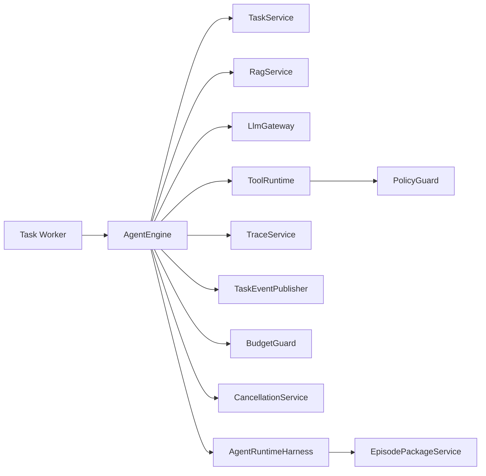
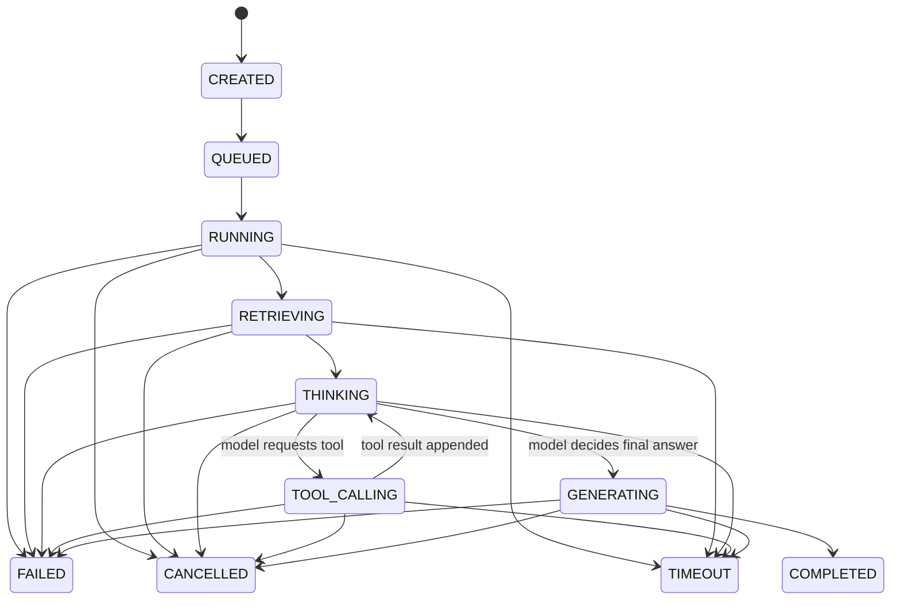
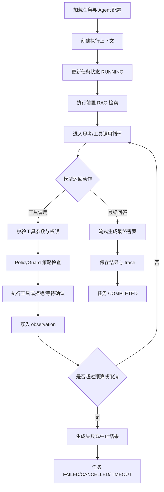

# AgentFlow Hub Agent 执行引擎设计

本文档用于沉淀 AgentFlow Hub 的 Agent 执行引擎设计，包括职责边界、状态机、执行循环、Prompt 契约、工具调用协议、预算控制、失败处理、SSE 事件和 V0.1/V1.0 实现边界。

核心结论：

> AgentFlow Hub 不使用完全黑盒的 Agent 框架来托管执行流程，而是自研一个轻量、可控、可观测的 Agent 执行状态机。模型负责理解、规划和生成，后端负责状态、权限、预算、工具执行、策略检查、日志、重试和失败处理。V1.0 在 AgentEngine 之上补充轻量 Agent Runtime Harness，用于生成运行证据包和治理工具调用。

---

## 1. 设计目标

Agent 执行引擎要解决的问题：

- 支持用户提交一个复杂任务。
- 自动结合知识库 RAG 和工具调用完成分析。
- 支持多步执行，而不是单次问答。
- 每一步都能保存、展示、回放。
- 限制最大步数、工具调用次数、token 成本和执行时间。
- 工具调用必须经过后端校验、权限和超时控制。
- 工具调用必须经过 PolicyGuard 策略检查。
- 支持 SSE 流式展示执行过程和最终答案。
- 出错时能定位失败发生在哪一步。
- 每次任务可以聚合为 Agent Episode Package，支持回放、导出和评测复盘。

最终希望面试时能讲清楚：

> 我没有只是调大模型 API，而是设计了一个可控的 Agent Runtime。它通过任务状态机管理执行过程，通过工具运行时隔离外部动作，通过 Trace 记录 LLM、RAG、工具调用，通过预算和超时机制避免 Agent 失控。

---

## 2. 职责边界

### 2.1 AgentEngine 负责什么

AgentEngine 负责：

- 加载任务和 Agent 配置。
- 创建执行上下文。
- 驱动任务状态流转。
- 触发 RAG 检索。
- 构造模型请求。
- 解析模型返回的动作。
- 调用工具运行时。
- 累积观察结果。
- 判断是否继续执行。
- 生成最终回答。
- 记录 step、trace 和事件。
- 调用 Harness 钩子生成 episode summary 和策略检查记录。
- 处理取消、超时和失败。

### 2.2 AgentEngine 不负责什么

AgentEngine 不负责：

- 具体文档解析。
- 具体向量库 SDK 调用。
- 具体工具业务逻辑。
- 具体模型供应商 API。
- 前端展示逻辑。
- 复杂多 Agent 协作。

这些能力分别由：

- `RagService`
- `ToolRuntime`
- `LlmGateway`
- `TaskEventPublisher`
- `TraceService`

来承载。

---

## 3. 核心协作对象



对象职责：

| 对象 | 职责 |
| --- | --- |
| `TaskWorker` | 从线程池或 RabbitMQ 中消费任务，调用 AgentEngine |
| `AgentEngine` | Agent 执行主流程 |
| `TaskService` | 任务创建、状态更新、查询、取消 |
| `RagService` | RAG 检索和上下文构造 |
| `LlmGateway` | 模型 chat、streamChat、embedding、rerank |
| `ToolRuntime` | 工具校验、权限、执行、重试 |
| `TraceService` | 保存 step、LLM log、RAG log、tool log |
| `TaskEventPublisher` | 保存并推送 SSE 事件 |
| `BudgetGuard` | 检查步数、工具次数、token、耗时 |
| `CancellationService` | 判断任务是否被用户取消 |
| `AgentRuntimeHarness` | 聚合 episode、暴露 harness 钩子、支撑评测复盘 |
| `EpisodePackageService` | 从 task、step、RAG、LLM、tool、event 聚合可导出的运行证据包 |
| `PolicyGuard` | 在工具执行前做策略检查，输出 `ALLOW` / `WARN` / `BLOCK` / `REVIEW` |

---

## 4. 任务状态机

### 4.1 Agent Task 状态

```text
CREATED
QUEUED
RUNNING
RETRIEVING
THINKING
TOOL_CALLING
GENERATING
COMPLETED
FAILED
CANCELLED
TIMEOUT
```

### 4.2 状态含义

| 状态 | 含义 |
| --- | --- |
| `CREATED` | 任务记录已创建 |
| `QUEUED` | 任务已进入执行队列 |
| `RUNNING` | 任务开始执行 |
| `RETRIEVING` | 正在进行 RAG 检索 |
| `THINKING` | 正在调用模型判断下一步动作 |
| `TOOL_CALLING` | 正在执行工具 |
| `GENERATING` | 正在生成最终回答 |
| `COMPLETED` | 任务成功完成 |
| `FAILED` | 任务失败 |
| `CANCELLED` | 用户取消 |
| `TIMEOUT` | 任务超时 |

### 4.3 状态流转



### 4.4 状态机原则

- 状态只能由后端更新，模型不能直接决定任务状态。
- 每次状态变化都要写入 `agent_task`。
- 关键状态变化要发布 SSE 事件。
- 失败状态必须记录 `error_code` 和 `error_message`。
- 任务完成时必须写入 `final_answer`、token 统计和完成时间。

---

## 5. Agent Step 设计

一次任务由多个 step 组成。

### 5.1 Step 类型

```text
RAG_RETRIEVAL
LLM_THINKING
TOOL_CALL
LLM_GENERATION
FINAL_ANSWER
SYSTEM
```

### 5.2 Step 记录原则

每个 step 至少记录：

- step index。
- step type。
- step title。
- status。
- input snapshot。
- output snapshot。
- startedAt。
- endedAt。
- latencyMs。
- errorCode。
- errorMessage。

### 5.3 示例 step 序列

用户问题：

> 帮我分析 order_1024 支付失败的原因，并给出处理建议。

可能 step：

| step_index | step_type | title |
| --- | --- | --- |
| 1 | `RAG_RETRIEVAL` | 检索支付失败相关知识 |
| 2 | `LLM_THINKING` | 判断需要查询订单状态 |
| 3 | `TOOL_CALL` | 调用订单查询工具 |
| 4 | `LLM_THINKING` | 判断需要查询支付日志 |
| 5 | `TOOL_CALL` | 调用支付日志查询工具 |
| 6 | `LLM_GENERATION` | 生成最终分析和建议 |
| 7 | `FINAL_ANSWER` | 保存最终答案 |

---

## 6. 执行上下文 AgentExecutionContext

Agent 执行期间维护一个上下文对象。

建议字段：

```text
taskId
userId
agentId
conversationId
userInput
agentConfigSnapshot
systemPrompt
modelProvider
modelName
modelOptions
boundKnowledgeBaseIds
availableTools
conversationMessages
retrievedChunks
observations
stepIndex
toolCallCount
inputTokens
outputTokens
totalTokens
startedAt
deadlineAt
cancelled
```

### 6.1 retrievedChunks

保存本次任务已经检索到的知识片段：

```json
[
  {
    "chunkId": "10001",
    "documentId": "101",
    "fileName": "payment-error-guide.md",
    "score": 0.8421,
    "content": "E_PAY_TIMEOUT 表示支付网关响应超时..."
  }
]
```

### 6.2 observations

保存工具调用结果和关键中间结论：

```json
[
  {
    "type": "TOOL_RESULT",
    "toolCode": "order_query",
    "content": "订单 order_1024 当前支付状态为 PAY_FAILED，错误码 E_PAY_TIMEOUT。"
  }
]
```

### 6.3 为什么要有上下文对象

原因：

- 避免方法之间传太多参数。
- 方便预算统计。
- 方便构造 Prompt。
- 方便 Trace 回放。
- 方便后续扩展记忆、人工确认、多轮对话。

---

## 7. 执行主流程

### 7.1 总体流程



### 7.2 伪代码

```java
public void execute(AgentExecutionCommand command) {
    AgentExecutionContext ctx = loadContext(command);

    try {
        taskService.markRunning(ctx.taskId());
        eventPublisher.publishTaskStarted(ctx);

        checkCancellationAndBudget(ctx);

        runPreRetrieval(ctx);

        while (true) {
            checkCancellationAndBudget(ctx);

            AgentDecision decision = think(ctx);

            if (decision.isFinalAnswer()) {
                generateFinalAnswer(ctx, decision);
                taskService.markCompleted(ctx.taskId(), ctx.finalAnswer(), ctx.usage());
                eventPublisher.publishTaskCompleted(ctx);
                return;
            }

            if (decision.isToolCall()) {
                executeToolCall(ctx, decision.toolCall());
                continue;
            }

            throw new AgentExecutionException("AGENT_INVALID_DECISION", "Model returned unsupported decision");
        }
    } catch (TaskCancelledException e) {
        taskService.markCancelled(ctx.taskId());
        eventPublisher.publishTaskCancelled(ctx);
    } catch (TaskTimeoutException e) {
        taskService.markTimeout(ctx.taskId(), e.getMessage());
        eventPublisher.publishTaskFailed(ctx, "TASK_TIMEOUT", e.getMessage());
    } catch (Exception e) {
        taskService.markFailed(ctx.taskId(), resolveErrorCode(e), e.getMessage());
        eventPublisher.publishTaskFailed(ctx, resolveErrorCode(e), e.getMessage());
    }
}
```

---

## 8. RAG 策略

### 8.1 V1.0 默认策略

默认使用：

> 前置 RAG 检索 + 工具调用循环。

即每次任务开始时，先根据用户输入检索 Agent 绑定的知识库。

原因：

- 简单稳定。
- 容易解释。
- 适合企业知识库问答和业务诊断场景。
- 避免模型第一步就乱调用工具。

### 8.2 RAG 输入

```text
userInput
boundKnowledgeBaseIds
topK
similarityThreshold
useRerank
```

### 8.3 RAG 输出

```text
retrievalId
hits
contextText
citations
latencyMs
```

### 8.4 RAG 结果进入上下文

RAG 结果会进入：

- `AgentExecutionContext.retrievedChunks`
- `rag_retrieval_log`
- `rag_retrieval_hit`
- SSE `RAG_FINISHED`
- 后续 Prompt 的 `Knowledge Context`

### 8.5 后续增强

V1.5 可以加入：

- Agent 主动调用 `knowledge_search` 工具进行二次检索。
- Hybrid Search。
- Rerank。
- Query Rewrite。

---

## 9. Prompt 契约

Agent 引擎中的 Prompt 分为三类：

- Thinking Prompt：让模型判断下一步动作。
- Tool Result Prompt：把工具结果写回上下文后继续判断。
- Final Answer Prompt：生成面向用户的最终回答。

### 9.1 Thinking Prompt 结构

建议结构：

```text
System:
{agent.systemPrompt}

Execution Rules:
- You must use only the tools provided by the system.
- You must not invent tool results.
- If business data is required, call an appropriate tool.
- If the answer can be derived from knowledge and observations, produce a final answer.
- Keep reasoning concise.
- Follow the max step and tool budget.

User Task:
{userInput}

Knowledge Context:
{retrievedChunks}

Available Tools:
{toolSpecs}

Observations:
{observations}

Return one of:
1. A tool call with valid JSON arguments.
2. A final answer.
```

### 9.2 Final Answer Prompt 结构

```text
System:
{agent.systemPrompt}

User Task:
{userInput}

Knowledge Context:
{retrievedChunks}

Tool Observations:
{observations}

Requirements:
- Give a clear conclusion first.
- Explain evidence from knowledge base and tool results.
- Include cited documents if available.
- Provide actionable next steps.
- Do not claim facts not present in knowledge context or tool observations.
```

### 9.3 Prompt 设计原则

- 任务规则由后端固定注入，用户不能覆盖。
- Agent 的 system prompt 可配置，但不能移除安全和执行规则。
- 工具列表由后端根据 Agent 绑定关系生成。
- 知识库内容和工具结果分区放入 Prompt，避免混淆。
- 最终回答要求引用证据，不允许凭空编造业务数据。

---

## 10. 模型动作 AgentDecision

AgentEngine 不直接信任自然语言结果，而是将模型响应解析为明确动作。

### 10.1 动作类型

```text
TOOL_CALL
FINAL_ANSWER
```

V1.0 不引入复杂动作类型。

### 10.2 TOOL_CALL

```json
{
  "type": "TOOL_CALL",
  "toolName": "order_query",
  "arguments": {
    "orderNo": "order_1024"
  },
  "reason": "需要查询订单当前支付状态和错误码。"
}
```

### 10.3 FINAL_ANSWER

```json
{
  "type": "FINAL_ANSWER",
  "answerDraft": "根据目前知识库和工具结果，支付失败主要由支付网关响应超时导致。"
}
```

### 10.4 解析策略

优先使用模型原生 Tool Calling 能力。

兜底策略：

- 要求模型返回 JSON。
- 后端进行 JSON parse。
- parse 失败则重试一次。
- 仍失败则任务失败，错误码 `AGENT_INVALID_DECISION`。

---

## 11. 工具调用协议

### 11.1 工具调用必须经过 ToolRuntime

模型只能提出工具调用意图，不能直接执行工具。

执行流程：

1. 模型返回 tool name 和 arguments。
2. 后端确认工具是否存在。
3. 后端确认 Agent 是否绑定该工具。
4. 后端校验工具是否启用。
5. 后端按 JSON Schema 校验 arguments。
6. PolicyGuard 检查工具权限、预算、重复调用和是否需要人工确认。
7. ToolRuntime 执行工具。
8. 保存 `tool_call_log`。
9. 将工具结果写入 observations。

### 11.2 工具入参校验失败

处理策略：

- 记录 `tool_call_log`，状态 `REJECTED`。
- 发布 `TOOL_FINISHED` 事件，状态 `REJECTED`。
- 将错误观察写回上下文。
- 允许模型重新生成一次工具参数。
- 连续失败超过阈值则任务失败。

### 11.3 工具执行失败

处理策略：

- 根据工具配置进行有限重试。
- 超时记为 `TIMEOUT`。
- 业务异常记为 `FAILED`。
- 将失败结果写入 observation。
- 如果工具非关键，可以让模型基于已有信息继续。
- 如果工具关键，任务失败或进入最终回答说明无法完成。

### 11.4 工具结果格式

工具结果应包含：

```json
{
  "success": true,
  "summary": "订单 order_1024 当前状态为 PAY_FAILED，错误码 E_PAY_TIMEOUT。",
  "data": {
    "orderNo": "order_1024",
    "paymentStatus": "PAY_FAILED",
    "errorCode": "E_PAY_TIMEOUT"
  },
  "errorCode": null,
  "errorMessage": null
}
```

说明：

- `summary` 给模型阅读。
- `data` 给 trace 和前端展示。
- 失败时 `success=false`，并提供错误码。

---

## 12. 预算与安全控制

### 12.1 必须限制

每个 Agent 配置：

- `maxSteps`
- `maxToolCalls`
- `maxTokens`
- `timeoutSeconds`

每个工具配置：

- `timeoutMs`
- `retryCount`
- `permissionLevel`
- `requiresConfirmation`

### 12.2 BudgetGuard 检查项

每次循环前检查：

- 当前 step 是否超过 `maxSteps`。
- 当前工具调用次数是否超过 `maxToolCalls`。
- 当前 token 是否超过 `maxTokens`。
- 当前时间是否超过 `deadlineAt`。
- 任务是否被取消。

### 12.3 超限处理

| 超限类型 | 处理 |
| --- | --- |
| step 超限 | 进入最终回答，说明已达到最大执行步数 |
| tool call 超限 | 禁止继续调用工具，要求生成基于已有证据的答案 |
| token 超限 | 停止执行，任务失败或生成简短总结 |
| 时间超限 | 标记 `TIMEOUT` |
| 用户取消 | 标记 `CANCELLED` |

推荐策略：

- step/tool 超限优先尝试生成“基于已有信息的部分答案”。
- token/timeout/cancel 更适合终止任务。

---

## 13. SSE 事件与执行过程展示

AgentEngine 通过 `TaskEventPublisher` 发布事件。

### 13.1 关键事件

| 事件 | 触发时机 |
| --- | --- |
| `TASK_STARTED` | 任务开始 |
| `RAG_STARTED` | RAG 检索开始 |
| `RAG_FINISHED` | RAG 检索完成 |
| `LLM_STARTED` | 模型调用开始 |
| `LLM_FINISHED` | 模型调用完成 |
| `TOOL_STARTED` | 工具调用开始 |
| `TOOL_FINISHED` | 工具调用结束 |
| `POLICY_CHECKED` | 工具策略检查完成 |
| `CONFIRMATION_REQUIRED` | 工具调用需要人工确认 |
| `TOKEN_DELTA` | 最终答案流式 token |
| `STEP_FINISHED` | step 完成 |
| `EPISODE_READY` | episode package 已聚合完成 |
| `TASK_COMPLETED` | 任务完成 |
| `TASK_FAILED` | 任务失败 |
| `TASK_CANCELLED` | 任务取消 |

### 13.2 事件发布原则

- 所有事件先写入 `agent_task_event`，再推送 SSE。
- SSE 断开后，前端可以通过 `sequenceNo` 补拉历史事件。
- `TOKEN_DELTA` 可以高频推送，但其他事件应保持语义清晰。
- 事件 payload 不应包含完整 prompt，避免前端负载过大。
- 完整 prompt 和响应通过 Trace 页面查看。

---

## 14. Trace 记录策略

### 14.1 必须记录

每次任务必须记录：

- `agent_task`
- `agent_step`
- `agent_task_event`

涉及模型时记录：

- `llm_call_log`

涉及 RAG 时记录：

- `rag_retrieval_log`
- `rag_retrieval_hit`

涉及工具时记录：

- `tool_call_log`

涉及策略检查时记录：

- `policy_check_log`

任务完成后可聚合：

- `agent_episode`

### 14.2 Trace 与 Step 的关系

推荐关系：

- 每个 RAG step 对应一条 `rag_retrieval_log`。
- 每个 LLM thinking/generation step 对应一条 `llm_call_log`。
- 每个 tool call step 对应一条 `tool_call_log`。
- 一个 step 可以关联多个日志，但 V1.0 尽量保持一对一。

### 14.3 为什么保存快照

需要保存：

- Agent 配置快照。
- Prompt 内容。
- RAG 命中 chunk 快照。
- 工具名称和参数快照。
- 工具返回结果快照。
- 策略检查结果快照。
- 预算和成本快照。

原因：

- 后续 Agent 配置可能变化。
- 知识库文档可能被删除或重新解析。
- 工具定义可能修改。
- 历史 trace 仍应可回放、可排查、可评测。

---

## 15. 失败处理

### 15.1 错误分类

建议错误码：

```text
AGENT_CONFIG_NOT_FOUND
AGENT_DISABLED
AGENT_NO_AVAILABLE_TOOL
AGENT_INVALID_DECISION
AGENT_MAX_STEPS_EXCEEDED
AGENT_MAX_TOOL_CALLS_EXCEEDED
TASK_CANCELLED
TASK_TIMEOUT
RAG_RETRIEVAL_FAILED
LLM_PROVIDER_ERROR
LLM_RESPONSE_PARSE_FAILED
TOOL_NOT_FOUND
TOOL_NOT_BOUND
TOOL_ARGUMENT_INVALID
TOOL_EXECUTION_FAILED
TOOL_TIMEOUT
VECTOR_STORE_ERROR
```

### 15.2 失败记录要求

失败时必须：

- 更新 `agent_task.status`。
- 写入 `error_code`。
- 写入 `error_message`。
- 当前 step 标记失败。
- 发布 `TASK_FAILED` 或 `TASK_CANCELLED`。
- 保留已经产生的 trace。

### 15.3 可恢复和不可恢复错误

可恢复：

- 工具参数不合法。
- 非关键工具调用失败。
- LLM 返回格式错误一次。
- RAG 召回为空。

不可恢复：

- Agent 不存在。
- 用户无权限。
- 模型服务连续失败。
- 任务超时。
- 用户取消。
- 核心工具多次失败。

---

## 16. 并发与异步执行

### 16.1 V0.1

V0.1 可以使用：

- `ThreadPoolTaskExecutor`
- 内存中的 SSE emitter 管理
- 数据库保存 task/step/log

流程：

1. API 创建 task。
2. 提交到线程池。
3. 返回 taskId。
4. 前端订阅 SSE。

### 16.2 V1.0

V1.0 使用：

- RabbitMQ 投递 Agent 执行任务。
- Worker 消费任务。
- Redis 保存运行中状态。
- 数据库保存权威状态。

流程：

1. API 创建 `agent_task`。
2. 状态改为 `QUEUED`。
3. 投递 RabbitMQ。
4. Worker 消费。
5. AgentEngine 执行。
6. SSE 推送事件。

### 16.3 幂等控制

需要保证：

- 同一个 task 不被重复执行。
- Worker 重试不会生成重复 step。

策略：

- 执行前检查 task status，只有 `QUEUED` 可进入 `RUNNING`。
- 状态更新使用条件更新：

```sql
UPDATE agent_task
SET status = 'RUNNING'
WHERE id = ? AND status = 'QUEUED'
```

- 更新成功才真正执行。
- `agent_step` 使用 `(task_id, step_index)` 唯一约束。

---

## 17. 人工确认机制

V1.0 可以先预留，不强制完整实现。

适用场景：

- SQL 查询工具。
- 发送通知工具。
- 修改业务数据工具。
- 高权限 HTTP 工具。

流程：

1. 模型提出敏感工具调用。
2. ToolRuntime 判断 `requires_confirmation=true`。
3. 任务进入等待确认状态。
4. SSE 推送 `CONFIRMATION_REQUIRED`。
5. 用户确认后继续执行。

V1.0 当前项目主要工具是只读工具，因此可先不做完整等待确认。

---

## 18. Agent 引擎核心类建议

### 18.1 agent.engine

```text
AgentEngine
DefaultAgentEngine
AgentExecutionCommand
AgentExecutionContext
AgentDecision
AgentDecisionParser
AgentPromptBuilder
AgentStateMachine
BudgetGuard
AgentExecutionException
AgentRuntimeHarness
EpisodePackageService
PolicyGuard
```

### 18.2 agent.state

```text
AgentTaskStatus
AgentStepType
AgentStepStatus
AgentEventType
```

### 18.3 tool.runtime

```text
ToolRuntime
DefaultToolRuntime
ToolExecutionCommand
ToolExecutionResult
ToolSpec
ToolArgumentValidator
```

### 18.4 task.event

```text
TaskEvent
TaskEventPublisher
SseTaskEventPublisher
TaskEventRepository
```

---

## 19. V0.1 实现边界

V0.1 必须实现：

- AgentEngine 主流程。
- 前置 RAG。
- 1 到多次工具调用。
- 最大步数限制。
- 工具调用次数限制。
- 基础 token 统计，可粗略估算。
- SSE 基础事件。
- Trace 基础记录。
- 订单查询工具。
- 支付日志查询工具。
- 最终答案生成。

V0.1 可以简化：

- 不做 RabbitMQ，用线程池。
- 不做人工确认。
- 不做 Prompt 版本对比。
- 不做复杂取消恢复。
- 不做主动二次知识库检索工具。
- 工具重试可以先简单实现一次。

---

## 20. V1.0 完成标准

V1.0 Agent 执行引擎应支持：

1. 用户提交任务后立即返回 taskId。
2. 后端异步执行任务。
3. 前端通过 SSE 看到 RAG、LLM、工具调用和最终答案。
4. Agent 可以根据模型决策调用多个工具。
5. 工具调用必须经过绑定关系、启用状态、schema、权限和超时校验。
6. 任务有最大步数、工具次数、token 和超时限制。
7. 任务可以取消。
8. 所有 step、LLM、RAG、tool 调用都可在 Trace 页面回放。
9. 工具失败、LLM 失败、RAG 失败都有明确错误码。
10. 历史任务结果不会因为 Agent 配置或知识库修改而失去可解释性。
11. 工具执行前经过 PolicyGuard，策略结果进入 Trace。
12. 每次任务可以聚合为 Agent Episode Package，用于导出、回放和评测复盘。

---

## 21. 面试表达重点

Agent 引擎设计可以这样讲：

1. **可控执行**
   - 模型只负责产生动作，后端状态机负责真正执行和状态流转。

2. **工具安全**
   - 工具调用必须经过 Agent 绑定关系、JSON Schema、权限、超时和重试控制。

3. **可观测**
   - 每次任务拆成 step，并记录 LLM、RAG、工具调用日志，Trace 页面可以完整回放。

4. **防失控**
   - 设置最大步数、最大工具调用次数、token 预算和任务超时。

5. **流式体验**
   - 用户提交任务后立即得到 taskId，通过 SSE 看到检索、思考、工具调用和最终答案。

6. **工程化而不是 demo**
   - Agent 执行是异步任务，有状态机、幂等、失败处理和历史回放。

---

## 22. 当前不做的内容

V1.0 暂不做：

- 多 Agent 协商。
- 自我反思循环。
- 长期记忆系统。
- Agent 自动创建工具。
- Agent 自动修改业务数据。
- 复杂可视化工作流。
- 完整人工审批流。
- Agent 沙箱代码执行。
- 完整 Evaluation Harness。
- 受控 MCP Adapter。

这些内容作为 V2.0 扩展，不进入当前核心执行引擎。
