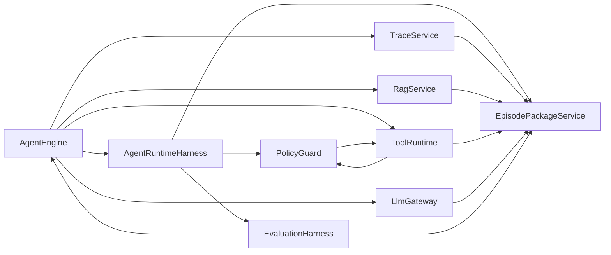
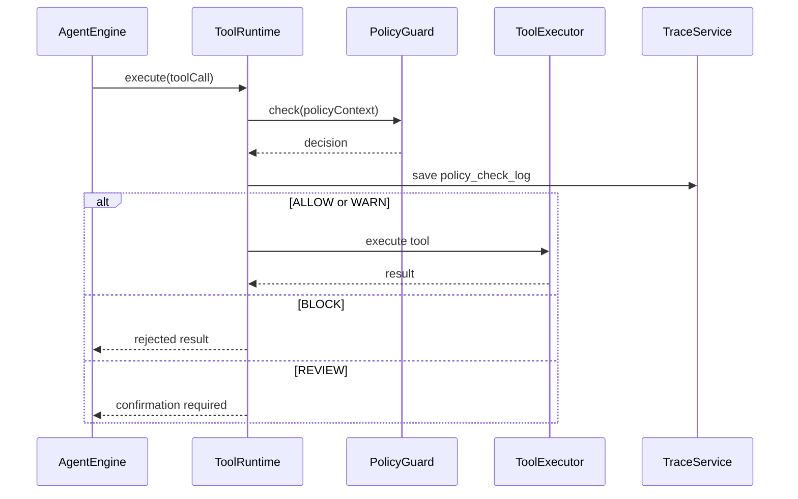

# AgentFlow Hub Agent Runtime Harness 设计

本文档用于沉淀 AgentFlow Hub 的 Agent Runtime Harness 设计，包括运行证据包、策略守卫、评测回归、受控 MCP 适配，以及它们和现有 AgentEngine、ToolRuntime、Trace、Evaluation 模块的关系。

这里的 Harness 指围绕 Agent 执行过程的一层工程化底座：

> 让一次 Agent 运行不仅能完成任务，还能被治理、被记录、被回放、被评测、被对比。

核心结论：

> AgentFlow Hub 不额外引入一个黑盒 Agent 框架，而是在现有自研 AgentEngine 之上补一层轻量 Harness 能力。V1.0 先做 Agent Episode Package 和 PolicyGuard 轻量版；V1.5 强化 Evaluation Harness；V2.0 再考虑受控 MCP Adapter。

---

## 1. 为什么需要 Harness

当前项目已经具备：

- Agent 状态机。
- ToolRuntime。
- RAG trace。
- LLM 调用日志。
- Agent step。
- 轻量评测表。

这些能力证明系统不是普通聊天机器人。

但如果希望更贴近真实 Agent 工程，需要继续回答几个问题：

- 一次 Agent 运行能不能完整复现？
- 不同 prompt、模型、RAG 参数的效果能不能回归比较？
- 工具调用能不能在执行前经过统一策略检查？
- 未来接入外部工具协议时，能不能仍然受控？

Harness 层解决这些问题。

---

## 2. 版本边界

### 2.1 V1.0 轻量 Harness

V1.0 增加两项轻量能力：

1. **Agent Episode Package**
   - 将一次 Agent 任务的配置、输入、RAG、LLM、工具、事件、预算和最终答案聚合成可导出的运行证据包。

2. **PolicyGuard**
   - 在工具执行前进行策略检查，输出 `ALLOW` / `WARN` / `BLOCK` / `REVIEW` 决策，并写入 trace。

V1.0 不做复杂页面，只要求能在 Trace 页面看到关键结果，并提供 API 导出。

### 2.2 V1.5 Evaluation Harness

V1.5 强化评测：

- 支持一键运行评测集。
- 支持 prompt 版本、RAG 参数、模型配置的对比。
- 统计 RAG 命中、工具调用匹配、引用准确、任务成功、token、耗时。
- 支持从历史 episode 回放或复用运行证据做回归分析。

### 2.3 V2.0 受控 MCP Adapter

V2.0 可做受控 MCP Adapter：

- 注册 allowlist MCP server。
- 拉取 MCP tool schema。
- 映射为平台 `tool_definition`。
- 仍然复用 Agent 工具绑定、权限、PolicyGuard、超时、trace 和评测。

不做完整 MCP marketplace，不允许任意 server 自动接入。

---

## 3. 总体架构



说明：

- `AgentEngine` 仍然是执行主流程。
- `ToolRuntime` 仍然是工具执行唯一入口。
- `PolicyGuard` 是工具执行前的安全策略层。
- `EpisodePackageService` 是 trace 聚合和导出层。
- `EvaluationHarness` 是评测运行、指标计算和版本对比层。

---

## 4. Agent Episode Package

### 4.1 目标

Episode Package 是一次 Agent 运行的完整证据包。

它用于：

- Trace 回放。
- 面试演示。
- 失败排查。
- 评测复盘。
- prompt / RAG / 工具版本对比。
- 后续导出到 OpenTelemetry 或外部观测系统。

### 4.2 内容结构

建议结构：

```json
{
  "episodeId": "ep_30001",
  "task": {},
  "agentSnapshot": {},
  "modelSnapshot": {},
  "promptSnapshot": {},
  "rag": {
    "retrievals": [],
    "hits": []
  },
  "steps": [],
  "llmCalls": [],
  "toolCalls": [],
  "policyChecks": [],
  "events": [],
  "budget": {
    "maxSteps": 8,
    "usedSteps": 6,
    "maxToolCalls": 5,
    "usedToolCalls": 2,
    "totalTokens": 4200,
    "totalCost": 0.031
  },
  "finalAnswer": "",
  "metrics": {
    "latencyMs": 12800,
    "success": true,
    "toolCallCount": 2,
    "retrievedChunkCount": 5
  }
}
```

### 4.3 V1.0 实现方式

不一定新建大量表。

V1.0 推荐：

- 继续以 `agent_task` 作为根对象。
- 从已有 `agent_step`、`llm_call_log`、`rag_retrieval_log`、`rag_retrieval_hit`、`tool_call_log`、`agent_task_event` 聚合。
- 增加 `agent_episode` 可选表，用于保存导出快照和摘要指标。
- Trace API 增加 `episode` 聚合视图。

### 4.4 最小 API

```text
GET /api/v1/tasks/{taskId}/episode
GET /api/v1/tasks/{taskId}/episode/export
```

### 4.5 面试表达

可以这样讲：

> 每次 Agent 执行都会形成一个 Episode Package，里面包含模型请求、RAG 命中、工具调用、策略检查、预算消耗和最终答案。这样历史任务不仅能看结果，还能完整复盘执行路径，并用于后续回归评测。

---

## 5. PolicyGuard

### 5.1 目标

PolicyGuard 是工具执行前的统一策略检查层。

它解决：

- 工具是否允许当前 Agent 调用。
- 工具参数是否存在风险。
- 是否需要人工确认。
- 是否超过预算或频率限制。
- 是否命中敏感数据策略。
- 是否允许外部 HTTP / MCP 工具执行。

### 5.2 决策类型

```text
ALLOW
WARN
BLOCK
REVIEW
```

含义：

| 决策 | 含义 |
| --- | --- |
| `ALLOW` | 允许执行 |
| `WARN` | 允许执行，但记录警告 |
| `BLOCK` | 阻止执行，向 Agent 写回拒绝 observation |
| `REVIEW` | 需要人工确认后继续 |

### 5.3 检查维度

V1.0 轻量检查：

- Agent 是否绑定该工具。
- 工具是否启用。
- 工具权限等级是否超出 Agent 能力。
- 参数是否通过 JSON Schema。
- 是否重复调用同一工具和参数。
- 是否超过最大工具调用次数。
- `HIGH` 工具是否默认进入 `REVIEW` 或 `BLOCK`。

V1.5 可增强：

- 工具级限流。
- 参数敏感字段检测。
- 工具结果脱敏。
- 高风险 HTTP 域名 allowlist。
- policy 命中统计。

### 5.4 调用流程



### 5.5 数据记录

建议增加：

```text
policy_check_log
```

关键字段：

- task_id。
- step_id。
- tool_call_id，可为空。
- tool_code。
- decision。
- policy_codes。
- reason。
- input_snapshot。
- created_at。

### 5.6 面试表达

可以这样讲：

> ToolRuntime 不是直接执行模型请求的工具调用，而是先进入 PolicyGuard。PolicyGuard 会根据工具绑定、权限等级、参数风险、预算和人工确认规则做决策，所有策略命中都会写入 trace。

---

## 6. Evaluation Harness

### 6.1 目标

Evaluation Harness 是对 Agent 的持续回归测试能力。

它不只是人工标记通过与否，而是把一次评测运行拆成可比较的指标。

### 6.2 评测维度

RAG 维度：

- Hit@K。
- MRR。
- Citation Accuracy。
- 召回 chunk 数。
- 平均相似度。

Agent 维度：

- 任务是否完成。
- 是否调用预期工具。
- 工具调用顺序是否匹配。
- 是否生成最终答案。
- 是否命中失败恢复策略。

成本与性能：

- total tokens。
- total cost。
- total latency。
- LLM latency。
- tool latency。

人工判断：

- passed。
- judge_comment。

### 6.3 对比能力

V1.5 建议支持：

- Prompt 版本 A/B。
- RAG topK 对比。
- 是否启用 rerank 对比。
- 不同模型配置对比。
- 不同 chunk 参数对比，可选。

### 6.4 与 Episode Package 的关系

每条 `eval_result` 可以关联：

- `task_id`。
- `episode_id`。
- `metrics`。

这样评测结果可以回到完整执行证据，而不只是一个分数。

### 6.5 面试表达

可以这样讲：

> 我把 Agent 评测做成了回归测试。每次评测运行会产生一组 episode，并计算 RAG 命中、工具调用匹配、引用准确、任务成功、成本和延迟。这样修改 prompt 或 RAG 参数后，可以看到系统效果是否真实变好。

---

## 7. 受控 MCP Adapter

### 7.1 定位

MCP 不进入 V1.0 主线。

未来如果实现，只做受控适配：

- 管理员注册 MCP server。
- server 必须 allowlist。
- 平台拉取 tool schema。
- 映射为 `tool_definition`。
- Agent 必须显式绑定后才能调用。
- 调用仍然经过 PolicyGuard 和 ToolRuntime。

### 7.2 不做什么

不做：

- 任意用户注册 MCP server。
- 自动发现全网 MCP server。
- 插件市场。
- 未审查工具直接暴露给模型。
- 让模型直接操作 MCP client。

### 7.3 最小数据字段

可在 V2.0 增加：

```text
mcp_server
mcp_tool_mapping
```

V1.0 只保留 `tool_definition.type = MCP`。

---

## 8. 实施顺序

推荐落地顺序：

1. 先完成 V0.1 主链路。
2. 在 Trace 聚合 API 上增加 Episode Package。
3. 在 ToolRuntime 前增加 PolicyGuard 轻量版。
4. 在 Trace 页面展示 policy checks 和 episode summary。
5. V1.5 再做 Evaluation Harness 的对比评测。
6. V2.0 再考虑受控 MCP Adapter。

---

## 9. 工作量预估

| 能力 | 轻量版 | 完整版 |
| --- | ---: | ---: |
| Episode Package | 2 到 4 天 | 5 到 7 天 |
| PolicyGuard | 3 到 5 天 | 约 1 周 |
| Evaluation Harness | 5 到 8 天 | 约 2 周 |
| 受控 MCP Adapter | 5 到 10 天 | 2 到 3 周 |

推荐不要一次全做。

V1.0 只加入：

- Episode Package 轻量版。
- PolicyGuard 轻量版。

V1.5 再加入：

- Evaluation Harness 完整一些。

V2.0 再加入：

- 受控 MCP Adapter。

---

## 10. 与现有文档的关系

本设计不替代原有专题文档。

对应关系：

| Harness 能力 | 主要落点 |
| --- | --- |
| Episode Package | Agent 执行引擎、Trace API、前端 Trace 页面、数据模型 |
| PolicyGuard | 工具系统、Agent 执行引擎、数据模型 |
| Evaluation Harness | 评测模型、RAG 评测口径、前端评测页 |
| 受控 MCP Adapter | 工具系统、数据模型、V2.0 规划 |

