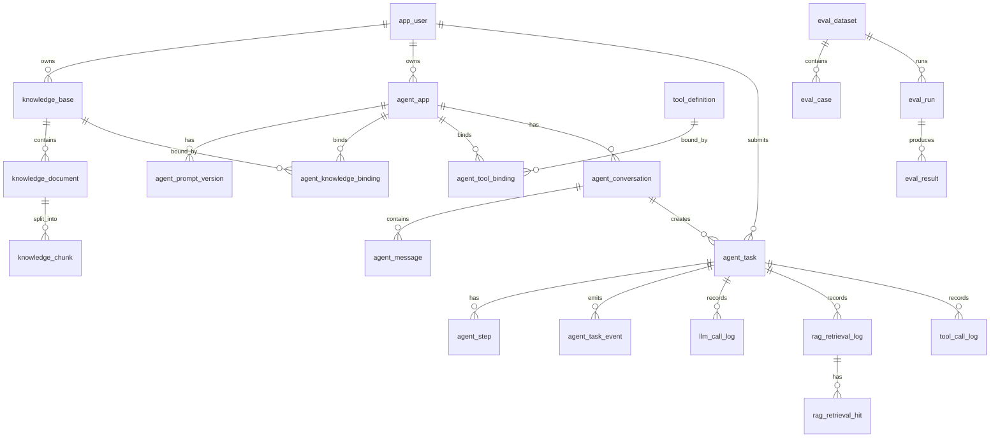

# AgentFlow Hub 数据库与领域模型设计

本文档用于沉淀 AgentFlow Hub 的核心领域模型、PostgreSQL 表设计、Qdrant payload 设计、关键索引和状态枚举。

设计目标：

> 表结构既要支撑 V1.0 的完整业务闭环，也要方便后续扩展到 Prompt 版本管理、Agent Trace、轻量评测和工具平台。

---

## 1. 数据建模原则

### 1.1 主键策略

所有核心业务表使用：

```text
BIGINT id
```

由后端通过 MyBatis-Plus `ASSIGN_ID` 生成。

原因：

- 国内 Java 后端项目常见。
- 便于分布式扩展。
- 避免数据库自增 ID 在未来拆分服务时产生迁移成本。

### 1.2 通用字段

核心业务表尽量包含：

```text
id BIGINT PRIMARY KEY
created_at TIMESTAMPTZ NOT NULL
updated_at TIMESTAMPTZ NOT NULL
deleted_at TIMESTAMPTZ NULL
```

需要审计的表额外包含：

```text
created_by BIGINT NULL
updated_by BIGINT NULL
```

### 1.3 状态字段

状态字段使用：

```text
VARCHAR(32)
```

不使用 PostgreSQL enum。

原因：

- 迁移简单。
- Java 枚举和数据库字符串映射更直接。
- 后续新增状态不需要修改数据库 enum 类型。

### 1.4 JSON 字段

工具 schema、模型参数、trace metadata 等使用：

```text
JSONB
```

典型使用场景：

- tool input schema。
- tool config。
- model options。
- agent config snapshot。
- step input/output。
- trace metadata。

### 1.5 删除策略

核心配置类数据使用软删除：

- 用户。
- 知识库。
- 文档。
- Agent。
- 工具定义。
- 评测集。

日志类和 trace 类数据默认不软删除：

- LLM 调用日志。
- 工具调用日志。
- RAG 召回记录。
- Agent step。

---

## 2. 领域模型总览

核心聚合：

| 聚合 | 说明 | 主要表 |
| --- | --- | --- |
| User | 用户与权限 | `app_user` |
| KnowledgeBase | 知识库、文档、chunk | `knowledge_base`、`knowledge_document`、`knowledge_chunk` |
| AgentApp | Agent 配置、Prompt 版本、绑定关系 | `agent_app`、`agent_prompt_version`、`agent_knowledge_binding`、`agent_tool_binding` |
| Tool | 工具定义与运行时配置 | `tool_definition` |
| AgentTask | Agent 一次执行任务及完整 trace | `agent_conversation`、`agent_message`、`agent_task`、`agent_step`、`agent_task_event` |
| Observability | LLM、RAG、工具调用记录 | `llm_call_log`、`rag_retrieval_log`、`rag_retrieval_hit`、`tool_call_log` |
| Evaluation | 轻量评测 | `eval_dataset`、`eval_case`、`eval_run`、`eval_result` |
| DemoBusiness | 模拟业务数据源 | `mock_order`、`mock_payment_log`、`mock_ticket` |

领域关系图：



---

## 3. 用户与权限

### 3.1 app_user

用途：

> 保存平台用户、登录凭证和基础角色。

V1.0 只做普通用户和管理员，不做复杂 RBAC。

| 字段 | 类型 | 说明 |
| --- | --- | --- |
| id | BIGINT | 主键 |
| username | VARCHAR(64) | 用户名，唯一 |
| email | VARCHAR(128) | 邮箱，唯一，可选 |
| password_hash | VARCHAR(255) | 密码哈希 |
| display_name | VARCHAR(64) | 显示名称 |
| role | VARCHAR(32) | `USER` / `ADMIN` |
| status | VARCHAR(32) | `ACTIVE` / `DISABLED` |
| last_login_at | TIMESTAMPTZ | 最近登录时间 |
| created_at | TIMESTAMPTZ | 创建时间 |
| updated_at | TIMESTAMPTZ | 更新时间 |
| deleted_at | TIMESTAMPTZ | 软删除时间 |

关键约束：

- `username` 唯一。
- `email` 唯一，但允许为空。

关键索引：

```text
uk_app_user_username(username)
uk_app_user_email(email)
idx_app_user_status(status)
```

---

## 4. 知识库模型

### 4.1 knowledge_base

用途：

> 表示一个用户创建的知识库。

| 字段 | 类型 | 说明 |
| --- | --- | --- |
| id | BIGINT | 主键 |
| user_id | BIGINT | 所属用户 |
| name | VARCHAR(128) | 知识库名称 |
| description | TEXT | 知识库描述 |
| embedding_provider | VARCHAR(64) | embedding 服务商 |
| embedding_model | VARCHAR(128) | embedding 模型 |
| chunk_size | INT | 默认 chunk 大小 |
| chunk_overlap | INT | 默认 chunk overlap |
| status | VARCHAR(32) | `ACTIVE` / `DISABLED` |
| metadata | JSONB | 扩展配置 |
| created_at | TIMESTAMPTZ | 创建时间 |
| updated_at | TIMESTAMPTZ | 更新时间 |
| deleted_at | TIMESTAMPTZ | 软删除时间 |

关键索引：

```text
idx_kb_user_created(user_id, created_at DESC)
idx_kb_user_status(user_id, status)
```

### 4.2 knowledge_document

用途：

> 保存用户上传文档的元数据和处理状态。

原始文件保存在 MinIO，不直接存数据库。

| 字段 | 类型 | 说明 |
| --- | --- | --- |
| id | BIGINT | 主键 |
| user_id | BIGINT | 所属用户 |
| knowledge_base_id | BIGINT | 所属知识库 |
| file_name | VARCHAR(255) | 原始文件名 |
| file_type | VARCHAR(32) | `TXT` / `MD` / `PDF` |
| mime_type | VARCHAR(128) | MIME 类型 |
| file_size | BIGINT | 文件大小 |
| content_hash | VARCHAR(128) | 文件内容 hash，用于去重 |
| storage_bucket | VARCHAR(128) | MinIO bucket |
| storage_object_key | VARCHAR(512) | MinIO object key |
| parse_status | VARCHAR(32) | 文档处理状态 |
| parse_error | TEXT | 失败原因 |
| chunk_count | INT | chunk 数量 |
| char_count | INT | 文本字符数 |
| token_count | INT | 估算 token 数 |
| created_at | TIMESTAMPTZ | 创建时间 |
| updated_at | TIMESTAMPTZ | 更新时间 |
| deleted_at | TIMESTAMPTZ | 软删除时间 |

文档处理状态：

```text
PENDING
PROCESSING
COMPLETED
FAILED
DELETED
```

关键索引：

```text
idx_doc_kb_status(knowledge_base_id, parse_status)
idx_doc_user_created(user_id, created_at DESC)
idx_doc_content_hash(content_hash)
```

### 4.3 knowledge_chunk

用途：

> 保存文档切分后的 chunk 文本和元数据。

向量本身存 Qdrant，PostgreSQL 只保存 chunk 文本、metadata 和 Qdrant vector id。

| 字段 | 类型 | 说明 |
| --- | --- | --- |
| id | BIGINT | 主键 |
| user_id | BIGINT | 所属用户 |
| knowledge_base_id | BIGINT | 所属知识库 |
| document_id | BIGINT | 所属文档 |
| chunk_index | INT | 文档内 chunk 序号 |
| content | TEXT | chunk 正文 |
| content_hash | VARCHAR(128) | chunk hash |
| vector_id | VARCHAR(128) | Qdrant 向量 ID |
| title_path | VARCHAR(512) | 标题路径，例如 `支付/失败处理/错误码` |
| token_count | INT | 估算 token 数 |
| char_count | INT | 字符数 |
| metadata | JSONB | 页码、标题、段落等扩展信息 |
| created_at | TIMESTAMPTZ | 创建时间 |
| updated_at | TIMESTAMPTZ | 更新时间 |

关键约束：

```text
uk_chunk_doc_index(document_id, chunk_index)
```

关键索引：

```text
idx_chunk_kb_doc(knowledge_base_id, document_id)
idx_chunk_vector_id(vector_id)
idx_chunk_content_hash(content_hash)
```

V1.5 可增加全文检索：

```text
GIN(to_tsvector('simple', content))
```

用于 Hybrid Search。

---

## 5. Agent 配置模型

### 5.1 agent_app

用途：

> 表示用户创建的一个可配置 Agent 应用。

| 字段 | 类型 | 说明 |
| --- | --- | --- |
| id | BIGINT | 主键 |
| user_id | BIGINT | 所属用户 |
| name | VARCHAR(128) | Agent 名称 |
| description | TEXT | Agent 描述 |
| system_prompt | TEXT | 当前 system prompt |
| current_prompt_version_id | BIGINT | 当前 Prompt 版本 |
| model_provider | VARCHAR(64) | 模型服务商 |
| model_name | VARCHAR(128) | 模型名称 |
| temperature | NUMERIC(4,3) | 温度 |
| top_p | NUMERIC(4,3) | topP |
| max_steps | INT | 最大执行步数 |
| max_tool_calls | INT | 最大工具调用次数 |
| max_tokens | INT | 单次任务最大 token 预算 |
| timeout_seconds | INT | 任务超时时间 |
| status | VARCHAR(32) | `ACTIVE` / `DISABLED` |
| config | JSONB | 扩展配置 |
| created_at | TIMESTAMPTZ | 创建时间 |
| updated_at | TIMESTAMPTZ | 更新时间 |
| deleted_at | TIMESTAMPTZ | 软删除时间 |

关键索引：

```text
idx_agent_user_created(user_id, created_at DESC)
idx_agent_user_status(user_id, status)
```

### 5.2 agent_prompt_version

用途：

> 保存 Agent system prompt 的历史版本，支持后续评测和回滚。

| 字段 | 类型 | 说明 |
| --- | --- | --- |
| id | BIGINT | 主键 |
| agent_id | BIGINT | 所属 Agent |
| version_no | INT | 版本号，从 1 递增 |
| system_prompt | TEXT | Prompt 内容 |
| change_note | VARCHAR(255) | 修改说明 |
| created_by | BIGINT | 创建人 |
| created_at | TIMESTAMPTZ | 创建时间 |

关键约束：

```text
uk_prompt_agent_version(agent_id, version_no)
```

### 5.3 agent_knowledge_binding

用途：

> Agent 与知识库的多对多绑定关系。

一个 Agent 可以绑定多个知识库。

| 字段 | 类型 | 说明 |
| --- | --- | --- |
| id | BIGINT | 主键 |
| agent_id | BIGINT | Agent ID |
| knowledge_base_id | BIGINT | 知识库 ID |
| priority | INT | 检索优先级 |
| created_at | TIMESTAMPTZ | 创建时间 |

关键约束：

```text
uk_agent_kb(agent_id, knowledge_base_id)
```

### 5.4 agent_tool_binding

用途：

> Agent 与工具的多对多绑定关系。

| 字段 | 类型 | 说明 |
| --- | --- | --- |
| id | BIGINT | 主键 |
| agent_id | BIGINT | Agent ID |
| tool_id | BIGINT | 工具 ID |
| enabled | BOOLEAN | 是否启用 |
| priority | INT | 工具展示或选择优先级 |
| config_override | JSONB | 针对该 Agent 的工具覆盖配置 |
| created_at | TIMESTAMPTZ | 创建时间 |
| updated_at | TIMESTAMPTZ | 更新时间 |

关键约束：

```text
uk_agent_tool(agent_id, tool_id)
```

---

## 6. 工具模型

### 6.1 tool_definition

用途：

> 保存平台可用工具定义。V1.0 以系统内置工具为主，但仍以表结构表达注册中心能力。

| 字段 | 类型 | 说明 |
| --- | --- | --- |
| id | BIGINT | 主键 |
| tool_code | VARCHAR(128) | 工具唯一编码，例如 `order_query` |
| name | VARCHAR(128) | 工具展示名称 |
| description | TEXT | 给模型看的工具描述 |
| type | VARCHAR(32) | `BUILTIN` / `HTTP` / `MCP` |
| input_schema | JSONB | JSON Schema 参数定义 |
| output_schema | JSONB | 输出结构说明 |
| config | JSONB | 工具运行配置 |
| timeout_ms | INT | 超时时间 |
| retry_count | INT | 失败重试次数 |
| requires_confirmation | BOOLEAN | 是否需要人工确认 |
| permission_level | VARCHAR(32) | `LOW` / `MEDIUM` / `HIGH` |
| status | VARCHAR(32) | `ACTIVE` / `DISABLED` |
| created_at | TIMESTAMPTZ | 创建时间 |
| updated_at | TIMESTAMPTZ | 更新时间 |
| deleted_at | TIMESTAMPTZ | 软删除时间 |

关键约束：

```text
uk_tool_code(tool_code)
```

V1.0 内置工具：

| tool_code | 说明 |
| --- | --- |
| `order_query` | 根据 orderId 查询模拟订单 |
| `payment_log_query` | 根据 orderId / errorCode 查询支付日志 |
| `ticket_query` | 查询历史相似工单 |
| `knowledge_search` | 主动检索知识库 |
| `report_generate` | 生成 Markdown 处理报告 |

---

## 7. 会话与 Agent 任务模型

### 7.1 agent_conversation

用途：

> 表示用户与某个 Agent 的一次会话。

V1.0 支持多轮对话展示，但 Agent 任务仍以单次用户输入为主要执行单位。

| 字段 | 类型 | 说明 |
| --- | --- | --- |
| id | BIGINT | 主键 |
| user_id | BIGINT | 用户 ID |
| agent_id | BIGINT | Agent ID |
| title | VARCHAR(255) | 会话标题 |
| status | VARCHAR(32) | `ACTIVE` / `ARCHIVED` |
| created_at | TIMESTAMPTZ | 创建时间 |
| updated_at | TIMESTAMPTZ | 更新时间 |
| deleted_at | TIMESTAMPTZ | 软删除时间 |

关键索引：

```text
idx_conversation_user_agent(user_id, agent_id, created_at DESC)
```

### 7.2 agent_message

用途：

> 保存会话中的用户消息和助手最终消息。

工具调用、RAG 召回等细节不放在 message 表，而是放在 trace 表中。

| 字段 | 类型 | 说明 |
| --- | --- | --- |
| id | BIGINT | 主键 |
| conversation_id | BIGINT | 会话 ID |
| task_id | BIGINT | 关联任务 ID，可为空 |
| role | VARCHAR(32) | `USER` / `ASSISTANT` |
| content | TEXT | 消息内容 |
| metadata | JSONB | 扩展信息 |
| created_at | TIMESTAMPTZ | 创建时间 |

关键索引：

```text
idx_message_conversation_created(conversation_id, created_at)
```

### 7.3 agent_task

用途：

> 表示 Agent 的一次任务执行，是 Trace 的根对象。

| 字段 | 类型 | 说明 |
| --- | --- | --- |
| id | BIGINT | 主键 |
| user_id | BIGINT | 用户 ID |
| agent_id | BIGINT | Agent ID |
| conversation_id | BIGINT | 会话 ID，可为空 |
| user_input | TEXT | 用户原始输入 |
| status | VARCHAR(32) | 任务状态 |
| config_snapshot | JSONB | Agent 配置快照 |
| max_steps | INT | 本次任务最大步数 |
| max_tool_calls | INT | 本次任务最大工具调用数 |
| max_tokens | INT | 本次任务最大 token |
| total_input_tokens | INT | 总输入 token |
| total_output_tokens | INT | 总输出 token |
| total_tokens | INT | 总 token |
| total_cost | NUMERIC(12,6) | 估算成本 |
| final_answer | TEXT | 最终答案 |
| error_code | VARCHAR(64) | 错误码 |
| error_message | TEXT | 错误信息 |
| started_at | TIMESTAMPTZ | 开始时间 |
| completed_at | TIMESTAMPTZ | 完成时间 |
| created_at | TIMESTAMPTZ | 创建时间 |
| updated_at | TIMESTAMPTZ | 更新时间 |

任务状态：

```text
CREATED
QUEUED
RUNNING
RETRIEVING
THINKING
TOOL_CALLING
GENERATING
COMPLETED
FAILED
CANCELLED
TIMEOUT
```

关键索引：

```text
idx_task_user_created(user_id, created_at DESC)
idx_task_agent_status(agent_id, status)
idx_task_conversation_created(conversation_id, created_at)
```

### 7.4 agent_step

用途：

> 保存一次 Agent 任务中的每个执行步骤。

| 字段 | 类型 | 说明 |
| --- | --- | --- |
| id | BIGINT | 主键 |
| task_id | BIGINT | 任务 ID |
| step_index | INT | 步骤序号 |
| step_type | VARCHAR(32) | 步骤类型 |
| title | VARCHAR(255) | 步骤标题 |
| status | VARCHAR(32) | 步骤状态 |
| input_data | JSONB | 输入快照 |
| output_data | JSONB | 输出快照 |
| error_code | VARCHAR(64) | 错误码 |
| error_message | TEXT | 错误信息 |
| started_at | TIMESTAMPTZ | 开始时间 |
| ended_at | TIMESTAMPTZ | 结束时间 |
| latency_ms | INT | 耗时 |
| created_at | TIMESTAMPTZ | 创建时间 |

步骤类型：

```text
RAG_RETRIEVAL
LLM_THINKING
TOOL_CALL
LLM_GENERATION
FINAL_ANSWER
SYSTEM
```

关键约束：

```text
uk_step_task_index(task_id, step_index)
```

### 7.5 agent_task_event

用途：

> 保存 Agent 执行过程中的事件，用于 SSE 推送和任务过程回放。

| 字段 | 类型 | 说明 |
| --- | --- | --- |
| id | BIGINT | 主键 |
| task_id | BIGINT | 任务 ID |
| event_type | VARCHAR(64) | 事件类型 |
| sequence_no | INT | 任务内递增序号 |
| payload | JSONB | 事件内容 |
| created_at | TIMESTAMPTZ | 创建时间 |

事件类型示例：

```text
TASK_STARTED
RAG_STARTED
RAG_FINISHED
LLM_STARTED
TOOL_STARTED
TOOL_FINISHED
TOKEN_DELTA
TASK_COMPLETED
TASK_FAILED
```

关键约束：

```text
uk_event_task_seq(task_id, sequence_no)
```

---

## 8. Trace 与 LLMOps 模型

### 8.1 llm_call_log

用途：

> 保存每次 LLM 调用详情。

| 字段 | 类型 | 说明 |
| --- | --- | --- |
| id | BIGINT | 主键 |
| task_id | BIGINT | 任务 ID |
| step_id | BIGINT | step ID，可为空 |
| provider | VARCHAR(64) | 模型服务商 |
| model_name | VARCHAR(128) | 模型名 |
| call_type | VARCHAR(32) | `CHAT` / `STREAM` / `EMBEDDING` / `RERANK` |
| prompt | TEXT | 最终 prompt 或请求内容 |
| response | TEXT | 模型响应 |
| input_tokens | INT | 输入 token |
| output_tokens | INT | 输出 token |
| total_tokens | INT | 总 token |
| estimated_cost | NUMERIC(12,6) | 估算成本 |
| latency_ms | INT | 耗时 |
| status | VARCHAR(32) | `SUCCESS` / `FAILED` |
| error_code | VARCHAR(64) | 错误码 |
| error_message | TEXT | 错误信息 |
| metadata | JSONB | 扩展元数据 |
| created_at | TIMESTAMPTZ | 创建时间 |

关键索引：

```text
idx_llm_task(task_id)
idx_llm_step(step_id)
idx_llm_provider_model(provider, model_name)
```

### 8.2 rag_retrieval_log

用途：

> 保存一次 RAG 检索请求的整体信息。

| 字段 | 类型 | 说明 |
| --- | --- | --- |
| id | BIGINT | 主键 |
| task_id | BIGINT | 任务 ID |
| step_id | BIGINT | step ID，可为空 |
| user_id | BIGINT | 用户 ID |
| query | TEXT | 检索 query |
| knowledge_base_ids | JSONB | 检索的知识库 ID 列表 |
| top_k | INT | 召回数量 |
| similarity_threshold | NUMERIC(5,4) | 相似度阈值 |
| use_rerank | BOOLEAN | 是否使用 rerank |
| latency_ms | INT | 检索耗时 |
| created_at | TIMESTAMPTZ | 创建时间 |

关键索引：

```text
idx_rag_task(task_id)
idx_rag_user_created(user_id, created_at DESC)
```

### 8.3 rag_retrieval_hit

用途：

> 保存一次 RAG 检索命中的 chunk 列表。

保存 content snapshot 是为了后续 trace 回放不受知识库修改影响。

| 字段 | 类型 | 说明 |
| --- | --- | --- |
| id | BIGINT | 主键 |
| retrieval_id | BIGINT | RAG 检索记录 ID |
| chunk_id | BIGINT | chunk ID |
| document_id | BIGINT | 文档 ID |
| knowledge_base_id | BIGINT | 知识库 ID |
| rank_no | INT | 召回排序 |
| score | NUMERIC(8,6) | 向量相似度 |
| rerank_score | NUMERIC(8,6) | rerank 分数 |
| content_snapshot | TEXT | 命中 chunk 内容快照 |
| metadata_snapshot | JSONB | 命中时 metadata 快照 |
| created_at | TIMESTAMPTZ | 创建时间 |

关键索引：

```text
idx_rag_hit_retrieval(retrieval_id, rank_no)
idx_rag_hit_chunk(chunk_id)
```

### 8.4 tool_call_log

用途：

> 保存每次工具调用详情。

| 字段 | 类型 | 说明 |
| --- | --- | --- |
| id | BIGINT | 主键 |
| task_id | BIGINT | 任务 ID |
| step_id | BIGINT | step ID，可为空 |
| tool_id | BIGINT | 工具 ID |
| tool_code | VARCHAR(128) | 工具编码快照 |
| tool_name | VARCHAR(128) | 工具名称快照 |
| arguments | JSONB | 工具入参 |
| result | JSONB | 工具出参 |
| status | VARCHAR(32) | 调用状态 |
| retry_count | INT | 重试次数 |
| latency_ms | INT | 耗时 |
| error_code | VARCHAR(64) | 错误码 |
| error_message | TEXT | 错误信息 |
| created_at | TIMESTAMPTZ | 创建时间 |

工具调用状态：

```text
PENDING
RUNNING
SUCCESS
FAILED
TIMEOUT
REJECTED
```

关键索引：

```text
idx_tool_call_task(task_id)
idx_tool_call_step(step_id)
idx_tool_call_tool(tool_id, created_at DESC)
```

---

## 9. 评测模型

### 9.1 eval_dataset

用途：

> 表示一个评测集。

| 字段 | 类型 | 说明 |
| --- | --- | --- |
| id | BIGINT | 主键 |
| user_id | BIGINT | 用户 ID |
| name | VARCHAR(128) | 评测集名称 |
| description | TEXT | 描述 |
| target_type | VARCHAR(32) | `AGENT` / `KNOWLEDGE_BASE` |
| target_id | BIGINT | 目标 ID |
| created_at | TIMESTAMPTZ | 创建时间 |
| updated_at | TIMESTAMPTZ | 更新时间 |
| deleted_at | TIMESTAMPTZ | 软删除时间 |

### 9.2 eval_case

用途：

> 评测集中的单个问题。

| 字段 | 类型 | 说明 |
| --- | --- | --- |
| id | BIGINT | 主键 |
| dataset_id | BIGINT | 评测集 ID |
| question | TEXT | 测试问题 |
| expected_answer | TEXT | 参考答案 |
| expected_document_ids | JSONB | 期望命中文档 |
| expected_tool_codes | JSONB | 期望调用工具 |
| metadata | JSONB | 扩展信息 |
| created_at | TIMESTAMPTZ | 创建时间 |
| updated_at | TIMESTAMPTZ | 更新时间 |

### 9.3 eval_run

用途：

> 一次评测运行。

| 字段 | 类型 | 说明 |
| --- | --- | --- |
| id | BIGINT | 主键 |
| dataset_id | BIGINT | 评测集 ID |
| user_id | BIGINT | 用户 ID |
| target_type | VARCHAR(32) | `AGENT` / `KNOWLEDGE_BASE` |
| target_id | BIGINT | 目标 ID |
| config_snapshot | JSONB | 本次评测配置快照 |
| status | VARCHAR(32) | `RUNNING` / `COMPLETED` / `FAILED` |
| total_cases | INT | case 总数 |
| passed_cases | INT | 通过数量 |
| failed_cases | INT | 失败数量 |
| started_at | TIMESTAMPTZ | 开始时间 |
| completed_at | TIMESTAMPTZ | 完成时间 |
| created_at | TIMESTAMPTZ | 创建时间 |

### 9.4 eval_result

用途：

> 一条评测 case 的执行结果。

| 字段 | 类型 | 说明 |
| --- | --- | --- |
| id | BIGINT | 主键 |
| run_id | BIGINT | eval run ID |
| case_id | BIGINT | eval case ID |
| task_id | BIGINT | 对应 Agent 任务，可为空 |
| answer | TEXT | 实际答案 |
| hit_document_ids | JSONB | 实际命中文档 |
| called_tool_codes | JSONB | 实际调用工具 |
| passed | BOOLEAN | 人工或规则判断是否通过 |
| judge_comment | TEXT | 判断说明 |
| metrics | JSONB | 命中率、耗时、token 等 |
| created_at | TIMESTAMPTZ | 创建时间 |

---

## 10. 模拟业务数据源

V1.0 需要内置模拟业务数据，以便工具调用不是纯 mock 字符串。

### 10.1 mock_order

用途：

> 模拟订单系统数据，供订单查询工具调用。

| 字段 | 类型 | 说明 |
| --- | --- | --- |
| id | BIGINT | 主键 |
| order_no | VARCHAR(64) | 订单号，例如 `order_1024` |
| user_no | VARCHAR(64) | 模拟用户编号 |
| amount | NUMERIC(12,2) | 订单金额 |
| currency | VARCHAR(16) | 币种 |
| status | VARCHAR(32) | 订单状态 |
| payment_status | VARCHAR(32) | 支付状态 |
| error_code | VARCHAR(64) | 支付错误码 |
| created_at | TIMESTAMPTZ | 创建时间 |
| updated_at | TIMESTAMPTZ | 更新时间 |

关键约束：

```text
uk_mock_order_no(order_no)
```

### 10.2 mock_payment_log

用途：

> 模拟支付日志，供日志查询工具调用。

| 字段 | 类型 | 说明 |
| --- | --- | --- |
| id | BIGINT | 主键 |
| order_no | VARCHAR(64) | 订单号 |
| trace_id | VARCHAR(128) | 模拟链路 ID |
| log_level | VARCHAR(16) | `INFO` / `WARN` / `ERROR` |
| error_code | VARCHAR(64) | 错误码 |
| message | TEXT | 日志内容 |
| occurred_at | TIMESTAMPTZ | 日志发生时间 |
| created_at | TIMESTAMPTZ | 创建时间 |

关键索引：

```text
idx_payment_log_order(order_no, occurred_at DESC)
idx_payment_log_error(error_code)
```

### 10.3 mock_ticket

用途：

> 模拟历史工单，供工单查询工具调用。

| 字段 | 类型 | 说明 |
| --- | --- | --- |
| id | BIGINT | 主键 |
| ticket_no | VARCHAR(64) | 工单号 |
| title | VARCHAR(255) | 标题 |
| content | TEXT | 工单内容 |
| solution | TEXT | 解决方案 |
| related_error_code | VARCHAR(64) | 相关错误码 |
| status | VARCHAR(32) | 工单状态 |
| created_at | TIMESTAMPTZ | 创建时间 |
| updated_at | TIMESTAMPTZ | 更新时间 |

关键索引：

```text
idx_ticket_error(related_error_code)
idx_ticket_status(status)
```

---

## 11. Qdrant Collection 设计

### 11.1 Collection

V1.0 使用一个 collection：

```text
kb_chunks
```

每个 chunk 对应一个 vector point。

### 11.2 Vector ID

推荐：

```text
vector_id = knowledge_chunk.id 的字符串形式
```

原因：

- PostgreSQL chunk 与 Qdrant point 一一对应。
- 删除文档时可以根据 chunk id 批量删除向量。
- trace 中容易回溯。

### 11.3 Payload

Qdrant payload 建议包含：

```json
{
  "user_id": "123",
  "knowledge_base_id": "456",
  "document_id": "789",
  "chunk_id": "10001",
  "chunk_index": 3,
  "file_name": "payment-error-guide.md",
  "file_type": "MD",
  "title_path": "支付/失败处理/错误码",
  "content_hash": "..."
}
```

说明：

- Qdrant 用 payload 做过滤。
- chunk 正文以 PostgreSQL 为准。
- payload 中可以保存少量展示字段，但不作为权威数据源。

### 11.4 Metadata Filter

常见过滤条件：

```text
user_id = 当前用户
knowledge_base_id IN Agent 绑定知识库列表
document_id IN 指定文档列表，可选
```

---

## 12. 核心状态枚举

### 12.1 文档处理状态

```text
PENDING
PROCESSING
COMPLETED
FAILED
DELETED
```

### 12.2 Agent 状态

```text
ACTIVE
DISABLED
```

### 12.3 Agent 任务状态

```text
CREATED
QUEUED
RUNNING
RETRIEVING
THINKING
TOOL_CALLING
GENERATING
COMPLETED
FAILED
CANCELLED
TIMEOUT
```

### 12.4 Agent Step 类型

```text
RAG_RETRIEVAL
LLM_THINKING
TOOL_CALL
LLM_GENERATION
FINAL_ANSWER
SYSTEM
```

### 12.5 工具类型

```text
BUILTIN
HTTP
MCP
```

V1.0 主要实现 `BUILTIN`。

### 12.6 工具调用状态

```text
PENDING
RUNNING
SUCCESS
FAILED
TIMEOUT
REJECTED
```

---

## 13. V0.1 与 V1.0 表设计边界

### 13.1 V0.1 最小表

V0.1 只需要这些表即可跑通闭环：

- `app_user`
- `knowledge_base`
- `knowledge_document`
- `knowledge_chunk`
- `agent_app`
- `tool_definition`
- `agent_task`
- `agent_step`
- `llm_call_log`
- `rag_retrieval_log`
- `rag_retrieval_hit`
- `tool_call_log`
- `mock_order`
- `mock_payment_log`

可以暂缓：

- `agent_conversation`
- `agent_message`
- `agent_prompt_version`
- `agent_knowledge_binding`
- `agent_tool_binding`
- `agent_task_event`
- 评测相关表
- `mock_ticket`

V0.1 中，Agent 可以默认绑定一个知识库和几个内置工具。

### 13.2 V1.0 完整表

V1.0 应补齐：

- Prompt 版本。
- Agent 与知识库绑定。
- Agent 与工具绑定。
- 会话和消息历史。
- SSE 事件回放。
- 评测集、评测 case、评测运行、评测结果。
- 工单模拟数据。

---

## 14. 面试表达重点

这套表设计面试时可以强调：

1. **领域边界清晰**
   - 用户、知识库、Agent、工具、任务、Trace、评测分开建模。

2. **Agent 执行可追踪**
   - `agent_task` 是一次执行根对象。
   - `agent_step` 保存多步执行过程。
   - `llm_call_log`、`rag_retrieval_log`、`tool_call_log` 分别记录模型、检索和工具调用。

3. **RAG 可回放**
   - 每次召回命中的 chunk 都有 `rag_retrieval_hit`。
   - 保存 content snapshot，避免后续知识库变更导致历史 trace 不可复现。

4. **工具平台可扩展**
   - 工具定义独立成表。
   - input schema、timeout、retry、permission、confirmation 都是配置化。

5. **数据和向量解耦**
   - PostgreSQL 保存权威业务数据和 chunk 文本。
   - Qdrant 保存向量和检索 payload。
   - 通过 `knowledge_chunk.vector_id` 关联。

6. **为评测预留结构**
   - 评测集、case、run、result 分层，后续可以支持 Prompt 对比和 RAG 参数对比。

---

## 15. 暂不设计的内容

V1.0 暂不设计：

- 复杂组织架构。
- 企业级 RBAC 权限树。
- 多租户计费。
- API key 管理后台。
- 插件市场。
- 多 Agent 共享记忆。
- 长期记忆画像。
- 完整 OpenTelemetry span 表。
- 大规模数据归档分区。

这些内容可以作为 V2.0 扩展方向，不进入当前核心表设计。

