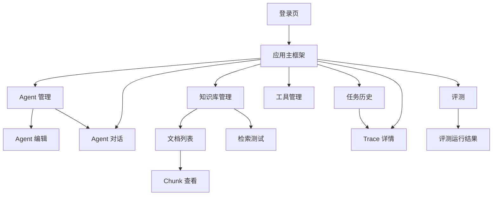

# AgentFlow Hub 前端页面与交互设计

本文档用于沉淀 AgentFlow Hub 的前端信息架构、页面设计、交互流程、组件结构、状态管理、SSE 接入方式和 V0.1/V1.0 实现边界。

核心结论：

> 前端定位为“企业研发运营支持 Agent 平台”的管理后台与演示控制台。它不做营销页，不做复杂视觉，不做拖拽工作流，重点是清晰展示知识库入库、Agent 配置、工具调用、任务执行和 Trace 回放。

---

## 1. 前端设计目标

前端需要服务三个目标：

1. **项目演示**
   - 能完整演示从上传文档到 Agent 分析问题的链路。
   - 面试官能直观看到 RAG、工具调用、SSE 和 Trace。

2. **开发调试**
   - 能测试知识库召回。
   - 能查看工具入参和出参。
   - 能查看 Agent 每一步执行记录。

3. **工程表达**
   - 页面结构和 API 调用清晰。
   - 能体现一个真实后台系统的组织方式。
   - 不让前端喧宾夺主，后端和 AI 工程能力才是重点。

---

## 2. 设计原则

### 2.1 产品形态

AgentFlow Hub 是偏后台、偏工作台的产品，应保持：

- 安静。
- 高信息密度。
- 清晰层级。
- 面向重复操作。
- 以表格、表单、详情页、时间线为主。

不做：

- 营销落地页。
- 大面积 hero 区。
- 夸张插画。
- 复杂动效。
- 拖拽式低代码编辑器。

### 2.2 页面布局

原则：

- 使用左侧导航 + 顶部用户区 + 主内容区。
- 主要页面优先用表格、分栏、抽屉、tabs。
- 避免卡片套卡片。
- 避免页面 section 全部做成漂浮卡片。
- Trace 和 Chat 页面可以使用左右分栏，提升信息对照效率。

### 2.3 视觉风格

推荐风格：

- 背景：浅灰白。
- 主色：理性蓝色，用于主操作和链接。
- 状态色：绿色成功、红色失败、黄色等待、蓝色运行中、灰色取消。
- 字体：系统默认字体。
- 圆角：后台控件保持 4 到 8px。
- 信息层级通过字号、间距、分割线、表格和标签区分。

不要让界面变成单一蓝色或紫色调。

### 2.4 控件使用

- 工具操作使用图标按钮，并配 tooltip。
- 主要命令使用 icon + text 按钮。
- 状态使用 tag。
- 多视图使用 tabs。
- 配置项使用表单。
- 数字配置使用 input number。
- 开关使用 switch。
- 模型参数使用 input number 或 slider。
- 长 JSON 使用代码编辑器或只读 JSON viewer。

---

## 3. 技术栈

最终选型：

```text
Vue 3
TypeScript
Vite
Vue Router
Pinia
Element Plus
Axios
@microsoft/fetch-event-source
```

### 3.1 为什么使用 Vue 3 + Element Plus

原因：

- 管理后台开发效率高。
- 表格、表单、抽屉、tabs、dialog 组件齐全。
- 学习和维护成本低。
- 更适合个人项目快速做出可演示版本。

### 3.2 SSE 客户端选择

不推荐直接使用原生 `EventSource`。

原因：

- 原生 `EventSource` 不能自定义 `Authorization` header。
- 项目后端使用 Bearer Token。
- 不应把 token 放到 URL query 中。

推荐使用：

```text
@microsoft/fetch-event-source
```

它可以通过 fetch 发起 SSE 请求，并携带：

```http
Authorization: Bearer <access_token>
```

---

## 4. 路由结构

推荐路由：

```text
/login

/agents
/agents/:agentId/edit
/agents/:agentId/chat

/knowledge-bases
/knowledge-bases/:kbId/documents
/knowledge-bases/:kbId/chunks
/knowledge-bases/:kbId/retrieve-test

/tools
/tools/:toolId

/tasks
/tasks/:taskId/trace

/evaluations
/evaluations/:datasetId
/eval-runs/:runId
```

默认登录后跳转：

```text
/agents
```

如果已有 Agent，也可以在前端提供“进入对话”的快捷操作。

---

## 5. 页面信息架构



---

## 6. 应用主框架

### 6.1 左侧导航

导航项：

- Agent
- Knowledge Bases
- Tools
- Tasks
- Evaluations

可选管理员入口：

- Demo Data

### 6.2 顶部区域

展示：

- 当前用户。
- 退出登录。
- 当前环境标识，例如 `Local`。

不做：

- 复杂全局搜索。
- 通知中心。
- 多组织切换。

### 6.3 主内容区

主内容区使用：

- 页面标题。
- 主要操作按钮。
- 筛选区。
- 表格或详情布局。

示例结构：

```text
PageHeader
Toolbar / Filters
MainTable or SplitPane
Drawer / Dialog
```

---

## 7. 登录页

### 7.1 功能

- 用户名。
- 密码。
- 登录按钮。
- 错误提示。

### 7.2 交互

- 输入为空时前端校验。
- 登录中按钮 loading。
- 登录成功保存 token 和用户信息。
- 登录失败展示后端错误信息。

### 7.3 V0.1

可以预置测试账号：

```text
username: demo
password: demo123
```

页面上不需要写长说明，只保留必要表单和登录入口。

---

## 8. Agent 管理页

路径：

```text
/agents
```

### 8.1 页面目标

让用户管理自己的 Agent，并快速进入对话。

### 8.2 页面结构

```text
Header: Agent
Actions: New Agent
Filters: status / keyword
Table:
  Name
  Model
  Status
  Knowledge Bases
  Tools
  Updated At
  Actions
```

### 8.3 操作

- 创建 Agent。
- 编辑 Agent。
- 启用/禁用 Agent。
- 删除 Agent。
- 进入对话。

### 8.4 表格动作

动作按钮：

- Chat
- Edit
- Enable/Disable
- Delete

删除需要确认弹窗。

---

## 9. Agent 编辑页

路径：

```text
/agents/:agentId/edit
```

### 9.1 页面目标

配置 Agent 的模型、Prompt、知识库、工具和执行限制。

### 9.2 页面结构

使用 tabs：

```text
Basic
Prompt
Knowledge
Tools
Limits
Versions
```

### 9.3 Basic tab

字段：

- name。
- description。
- status。
- modelProvider。
- modelName。
- temperature。
- topP。

### 9.4 Prompt tab

字段：

- systemPrompt。
- changeNote。

操作：

- Save as new version。
- Activate version。

V0.1 可以只保存当前 prompt，不做版本列表。

### 9.5 Knowledge tab

功能：

- 展示已绑定知识库。
- 添加知识库。
- 移除知识库。

表格字段：

- name。
- documentCount。
- status。
- priority。

### 9.6 Tools tab

功能：

- 展示可用工具。
- 勾选 Agent 可调用的工具。
- 查看工具 schema。

表格字段：

- enabled。
- toolCode。
- name。
- permissionLevel。
- requiresConfirmation。
- timeoutMs。

### 9.7 Limits tab

字段：

- maxSteps。
- maxToolCalls。
- maxTokens。
- timeoutSeconds。

### 9.8 Versions tab

V1.0 可展示 Prompt 版本：

- versionNo。
- createdAt。
- createdBy。
- changeNote。
- actions。

---

## 10. Agent 对话页

路径：

```text
/agents/:agentId/chat
```

这是项目最重要的演示页面之一。

### 10.1 页面目标

展示 Agent 如何执行一个真实任务：

- 接收用户问题。
- 进行 RAG 检索。
- 调用工具。
- 流式生成答案。
- 实时展示执行步骤。

### 10.2 推荐布局

使用三栏或两栏响应式布局。

桌面端：

```text
Left: Conversation / Task History
Center: Chat and Final Answer
Right: Execution Timeline / Citations
```

如果实现成本要低，V0.1 可以使用两栏：

```text
Center: Chat
Right: Execution Timeline
```

### 10.3 中间对话区

包含：

- 用户输入消息。
- Agent 最终回答。
- 流式输出中的回答。
- 引用标记 `[C1]`。
- 输入框。
- 发送按钮。
- 取消按钮。

输入框：

- 支持多行。
- Enter 发送，Shift + Enter 换行。
- 执行中禁用发送或允许新开任务，V1.0 建议禁用。

### 10.4 右侧执行时间线

展示 Agent 当前执行状态。

事件映射：

| SSE 事件 | UI 展示 |
| --- | --- |
| `TASK_STARTED` | 任务开始 |
| `RAG_STARTED` | 正在检索知识库 |
| `RAG_FINISHED` | 展示命中文档数量 |
| `LLM_STARTED` | 正在分析下一步 |
| `TOOL_STARTED` | 正在调用工具 |
| `TOOL_FINISHED` | 展示工具执行摘要 |
| `TOKEN_DELTA` | 追加到答案区 |
| `TASK_COMPLETED` | 标记完成 |
| `TASK_FAILED` | 显示失败原因 |
| `TASK_CANCELLED` | 显示已取消 |

时间线条目字段：

- step title。
- status。
- duration。
- summary。
- 可展开详情。

### 10.5 引用面板

显示当前回答使用的 citations：

- citationId。
- fileName。
- titlePath。
- score。
- chunk preview。

点击 `[C1]` 时：

- 高亮对应引用。
- 展示 chunk 详情抽屉。

### 10.6 任务状态

页面状态：

```text
IDLE
SUBMITTING
QUEUED
RUNNING
COMPLETED
FAILED
CANCELLED
```

### 10.7 失败体验

失败时展示：

- errorCode。
- errorMessage。
- 查看 Trace 按钮。

不要只显示“请求失败”。

### 10.8 示例任务快捷入口

V1.0 可以提供一个小型示例任务下拉：

```text
帮我分析 order_1024 支付失败的原因，并给出处理建议。
```

注意：

- 这只是填入输入框的快捷动作。
- 不要在页面大篇幅解释功能。

---

## 11. SSE 前端交互设计

### 11.1 提交任务

流程：

1. 用户点击发送。
2. 前端调用 `POST /api/v1/agents/{agentId}/tasks`。
3. 后端返回 `taskId` 和 `sseUrl`。
4. 前端用 `fetchEventSource` 连接 SSE。
5. 根据事件更新 UI。

### 11.2 fetchEventSource 示例

```ts
import { fetchEventSource } from '@microsoft/fetch-event-source'

await fetchEventSource(`/api/v1/tasks/${taskId}/events`, {
  headers: {
    Authorization: `Bearer ${token}`
  },
  onmessage(event) {
    const data = JSON.parse(event.data)
    handleTaskEvent(data)
  },
  onerror(err) {
    throw err
  }
})
```

### 11.3 断线恢复

V1.0 简化策略：

- SSE 断开后，重新调用 `GET /api/v1/tasks/{taskId}/trace` 拉取完整状态。
- 如果任务仍在运行，可以重新订阅 SSE。

V1.5 可增强：

- 使用 `sequenceNo` 补拉事件。
- 支持 Last-Event-ID。

---

## 12. 知识库管理页

路径：

```text
/knowledge-bases
```

### 12.1 页面目标

管理知识库并查看文档处理状态。

### 12.2 页面结构

表格字段：

- name。
- description。
- embeddingModel。
- documentCount。
- status。
- updatedAt。
- actions。

操作：

- New Knowledge Base。
- Edit。
- Documents。
- Retrieve Test。
- Delete。

---

## 13. 文档列表页

路径：

```text
/knowledge-bases/:kbId/documents
```

### 13.1 页面目标

上传文档，查看解析和向量化状态。

### 13.2 页面结构

顶部：

- 知识库名称。
- Upload Document。
- Retrieve Test。

表格字段：

- fileName。
- fileType。
- fileSize。
- parseStatus。
- chunkCount。
- parseError。
- createdAt。
- actions。

状态 tag：

- `PENDING`。
- `PROCESSING`。
- `COMPLETED`。
- `FAILED`。

操作：

- View Chunks。
- Reprocess。
- Delete。

### 13.3 上传交互

使用 Upload Dialog：

- 文件选择。
- 支持类型提示。
- 上传进度。
- 上传成功后刷新表格。
- 处理状态通过轮询或手动刷新查看。

V1.0 可以轮询文档状态：

```text
每 3 秒刷新一次 PROCESSING 文档，最多 2 分钟
```

---

## 14. Chunk 查看页

路径：

```text
/knowledge-bases/:kbId/chunks
```

也可以从文档详情进入：

```text
/documents/:documentId/chunks
```

### 14.1 页面目标

调试文档切分质量。

### 14.2 页面结构

筛选：

- document。
- keyword。
- chunkIndex。

表格字段：

- chunkIndex。
- document。
- titlePath。
- tokenCount。
- charCount。
- contentPreview。

点击行：

- 右侧抽屉显示完整 chunk。
- 展示 metadata JSON。

---

## 15. 检索测试页

路径：

```text
/knowledge-bases/:kbId/retrieve-test
```

### 15.1 页面目标

调试 RAG 召回效果。

### 15.2 页面结构

左侧表单：

- query。
- topK。
- similarityThreshold。
- useRerank。
- Run。

右侧结果：

- latencyMs。
- hit count。
- hits list。

hit 展示：

- rank。
- score。
- rerankScore。
- fileName。
- titlePath。
- content。

### 15.3 交互

- 点击 hit 可打开 chunk 详情。
- 支持复制 chunkId。
- 支持跳转到原文档 chunks。

---

## 16. 工具管理页

路径：

```text
/tools
```

### 16.1 页面目标

查看工具定义、schema、状态，并测试工具调用。

### 16.2 页面结构

表格字段：

- toolCode。
- name。
- type。
- permissionLevel。
- requiresConfirmation。
- timeoutMs。
- retryCount。
- status。
- actions。

操作：

- View。
- Enable/Disable。
- Test。

### 16.3 工具详情

用 drawer 展示：

- description。
- inputSchema。
- outputSchema。
- config。
- timeoutMs。
- retryCount。

JSON 使用只读代码块或 JSON viewer。

### 16.4 工具测试

测试面板：

- arguments JSON editor。
- Run。
- result JSON。
- latency。
- error。

V1.0 中普通用户可查看工具，管理员可启停工具。

---

## 17. 任务历史页

路径：

```text
/tasks
```

### 17.1 页面目标

查看历史 Agent 任务，快速进入 Trace。

### 17.2 表格字段

- taskId。
- agentName。
- userInput preview。
- status。
- totalTokens。
- totalCost。
- startedAt。
- completedAt。
- actions。

筛选：

- agent。
- status。
- date range。
- keyword。

操作：

- View Trace。
- Open Chat。

---

## 18. Trace 详情页

路径：

```text
/tasks/:taskId/trace
```

这是项目最重要的演示页面之一。

### 18.1 页面目标

完整回放一次 Agent 任务：

- 用户输入。
- Agent 配置快照。
- RAG 召回。
- LLM 调用。
- 工具调用。
- SSE 事件。
- 最终回答。
- 错误信息。

### 18.2 页面结构

顶部摘要：

- taskId。
- agentName。
- status。
- duration。
- totalTokens。
- totalCost。
- startedAt。

主体布局：

```text
Left: Step Timeline
Right: Detail Panel
```

或者使用 tabs：

```text
Overview
Steps
RAG
LLM Calls
Tool Calls
Events
Final Answer
```

推荐：

- V0.1 用 tabs，简单。
- V1.0 用左侧 timeline + 右侧 detail，更直观。

### 18.3 Overview tab

展示：

- userInput。
- finalAnswer。
- errorCode。
- errorMessage。
- agentSnapshot。

### 18.4 Steps tab

字段：

- stepIndex。
- stepType。
- title。
- status。
- latencyMs。
- startedAt。

点击 step：

- 查看 inputData。
- outputData。
- error。

### 18.5 RAG tab

展示：

- query。
- topK。
- threshold。
- useRerank。
- latencyMs。
- hits。

hit 字段：

- rank。
- score。
- rerankScore。
- fileName。
- titlePath。
- contentSnapshot。

### 18.6 LLM Calls tab

展示：

- modelName。
- callType。
- inputTokens。
- outputTokens。
- latencyMs。
- status。
- prompt。
- response。

prompt 和 response 默认折叠，避免页面过长。

### 18.7 Tool Calls tab

展示：

- toolCode。
- status。
- latencyMs。
- arguments。
- result。
- error。

### 18.8 Events tab

展示 SSE 事件回放：

- sequenceNo。
- eventType。
- timestamp。
- payload。

---

## 19. 评测页

路径：

```text
/evaluations
```

### 19.1 页面目标

轻量管理评测集，验证 RAG 和 Agent 效果。

### 19.2 评测集列表

字段：

- name。
- targetType。
- targetName。
- caseCount。
- updatedAt。
- actions。

操作：

- New Dataset。
- Cases。
- Run。
- Results。

### 19.3 Case 管理

字段：

- question。
- expectedAnswer。
- expectedDocumentIds。
- expectedToolCodes。

### 19.4 运行结果

展示：

- totalCases。
- passedCases。
- failedCases。
- hitRate。
- toolCallMatch。
- totalTokens。
- duration。

V1.0 允许人工标记：

- passed。
- judgeComment。

---

## 20. Demo Data 页面

可选管理员页面：

```text
/demo
```

用途：

- 查看 mock orders。
- 查看 mock payment logs。
- 查看 mock tickets。
- 一键 seed demo 数据。

V1.0 可以不放入主导航，只在管理员角色展示。

---

## 21. 前端目录结构

推荐：

```text
src
  main.ts
  App.vue

  router
    index.ts

  stores
    auth.ts
    agent.ts
    task.ts

  api
    http.ts
    auth.ts
    agents.ts
    knowledge.ts
    tools.ts
    tasks.ts
    trace.ts
    evaluations.ts

  layouts
    AppLayout.vue
    AuthLayout.vue

  views
    login
    agents
    chat
    knowledge
    tools
    tasks
    trace
    evaluations

  components
    common
    agent
    rag
    tool
    trace
    task

  composables
    useTaskEvents.ts
    usePagination.ts
    useConfirm.ts

  types
    api.ts
    agent.ts
    knowledge.ts
    tool.ts
    task.ts
    trace.ts
```

---

## 22. API Client 设计

### 22.1 Axios 实例

`api/http.ts` 负责：

- baseURL。
- Authorization header。
- 错误拦截。
- 401 跳转登录。
- 统一解包 `ApiResponse<T>`。

### 22.2 API 类型

前端定义与后端 DTO 对齐的 TypeScript 类型。

示例：

```ts
export interface AgentTask {
  id: string
  agentId: string
  status: AgentTaskStatus
  userInput: string
  finalAnswer?: string
  totalTokens?: number
  totalCost?: number
}
```

ID 统一使用 `string`。

---

## 23. 状态管理

使用 Pinia。

### 23.1 auth store

保存：

- accessToken。
- currentUser。
- isAuthenticated。

操作：

- login。
- logout。
- fetchMe。

### 23.2 task store

保存当前任务运行状态：

- currentTaskId。
- status。
- events。
- timelineItems。
- answerText。
- citations。
- error。

### 23.3 agent store

可缓存：

- agents。
- currentAgent。
- boundKnowledgeBases。
- boundTools。

注意：

- 不要把所有页面数据都塞到 Pinia。
- 普通列表数据可以留在页面组件中。

---

## 24. 关键组件设计

### 24.1 TaskEventTimeline

用途：

- 展示 Agent 执行事件。

props：

```ts
events: TaskEvent[]
activeSequenceNo?: number
```

### 24.2 StreamingAnswer

用途：

- 展示流式生成的最终答案。
- 支持 citation 点击。

props：

```ts
content: string
citations: Citation[]
```

### 24.3 CitationList

用途：

- 展示引用来源。

字段：

- citationId。
- fileName。
- titlePath。
- score。

### 24.4 JsonViewer

用途：

- 展示 tool arguments、tool result、metadata、payload。

要求：

- 支持折叠。
- 支持复制。

### 24.5 StatusTag

用途：

- 统一展示 task/document/tool/eval 状态。

---

## 25. V0.1 页面边界

V0.1 必须页面：

- 登录页，可以简化。
- Agent 列表页。
- Agent 对话页。
- 知识库列表页。
- 文档上传和列表页。
- 检索测试页。
- 任务 Trace 页，基础版。

V0.1 可以不做：

- Agent Prompt 版本页。
- 完整工具管理页。
- 完整评测页。
- Demo Data 页面。
- 精细权限 UI。
- 复杂响应式适配。

---

## 26. V1.0 页面完成标准

V1.0 前端应支持：

1. 用户登录。
2. 创建和编辑 Agent。
3. 配置 Agent Prompt、模型参数、知识库和工具。
4. 创建知识库。
5. 上传文档并查看处理状态。
6. 查看 chunks。
7. 运行知识库检索测试。
8. 在 Agent 对话页提交任务。
9. 通过 SSE 实时看到执行过程。
10. 查看最终回答和引用。
11. 查看工具列表和工具详情。
12. 查看任务历史。
13. 查看完整 Trace。
14. 创建轻量评测集并运行评测。

---

## 27. V1.5 增强项

推荐增强：

- Trace 页面可视化时间轴。
- RAG 命中 chunk 高亮。
- Prompt 版本 diff。
- 评测结果对比。
- 工具调用统计图。
- token 成本趋势。
- SSE 断线补偿。
- 更完整的空状态和错误状态。
- 简单压测结果展示。

---

## 28. 面试表达重点

前端设计可以这样讲：

1. **不是只做聊天框**
   - 前端覆盖知识库、Agent 配置、工具、任务历史、Trace 和评测。

2. **演示 Agent 执行过程**
   - 对话页通过 SSE 实时展示 RAG、LLM、工具调用和最终答案。

3. **Trace 可回放**
   - Trace 页面可以查看 step、RAG hit、LLM call、tool call 和事件流。

4. **服务后端工程展示**
   - 前端页面围绕后端核心能力组织，方便展示系统设计和排查链路。

5. **SSE 认证处理**
   - 使用 fetch-event-source 携带 Authorization header，避免把 token 放在 URL 中。

---

## 29. 当前不做的内容

V1.0 暂不做：

- 营销首页。
- 移动端深度适配。
- 拖拽式工作流编辑器。
- 复杂 BI 仪表盘。
- 多主题皮肤。
- 多人协作编辑。
- 实时多人会话。
- 前端低代码表单系统。

这些内容会增加复杂度，但对当前找实习的项目价值不高。

