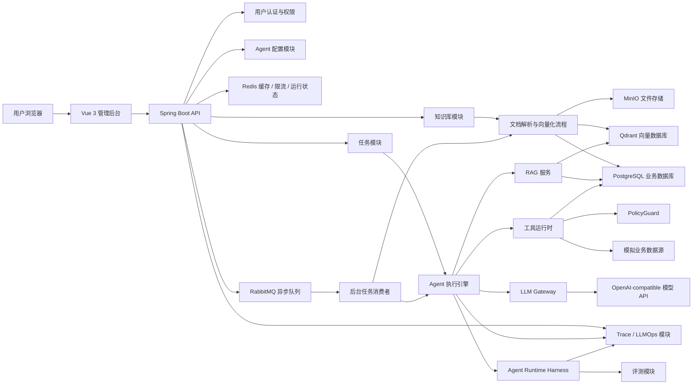
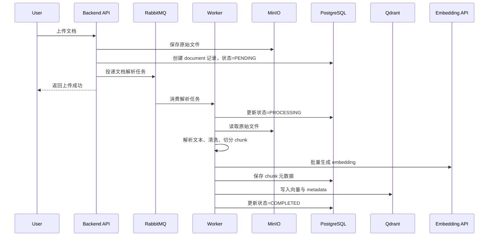
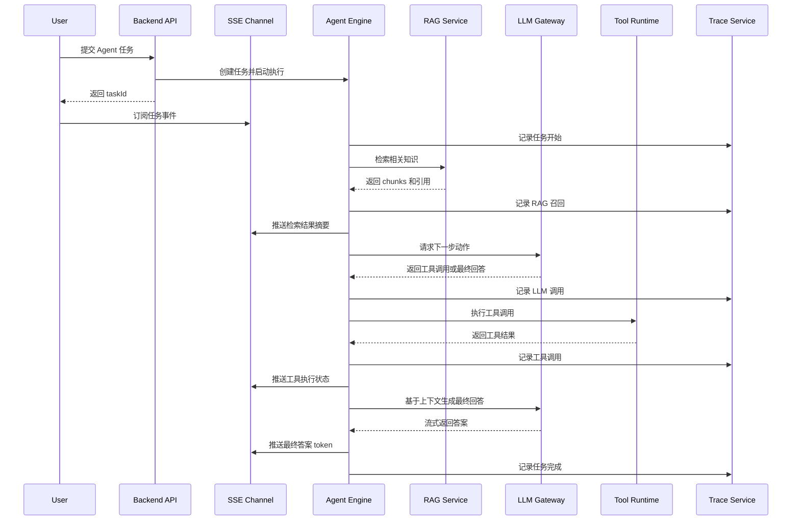

# AgentFlow Hub 项目规格文档

本文档用于沉淀 AgentFlow Hub 项目的定位、功能边界、版本规划、系统架构与技术栈选型。后续讨论中，只要产生有价值的项目决策，都应同步更新到本文档或相关专题文档中。

---

## 1. 项目定位

项目名称：

> AgentFlow Hub

项目全称：

> AgentFlow Hub：企业研发运营支持 Agent 平台

一句话描述：

> 一个企业内部 AI Agent 平台，支持上传业务文档、构建知识库、注册工具，并让 Agent 自动完成知识检索、业务数据查询、日志分析、工单诊断和报告生成。

核心定位：

> 本项目不是普通聊天机器人，也不是单纯 RAG demo，而是一个可配置、可扩展、可观测的企业级 Agent 应用平台。

面向目标：

- 支撑年底前申请深圳大厂开发类实习。
- 优先匹配 AI 应用开发、Agent 应用开发、Java 后端开发岗位。
- 展示 Java 后端工程能力、RAG 能力、Agent 工程化能力和 LLMOps 意识。

---

## 2. 目标能力

项目最终应体现三类能力：

### 2.1 Java 后端工程能力

- RESTful API 设计。
- 用户认证与权限控制。
- 数据库建模。
- Redis 缓存与限流。
- 异步任务。
- 消息队列。
- SSE 流式响应。
- 任务状态机。
- Docker Compose 本地部署。

### 2.2 AI 应用工程能力

- 文档解析。
- chunk 切分。
- embedding。
- 向量检索。
- RAG prompt 构造。
- 引用溯源。
- Tool Calling。
- Agent 多步执行。
- Agent 执行轨迹记录。

### 2.3 LLMOps 与可观测能力

- Prompt 版本记录。
- LLM 调用日志。
- token 成本统计。
- 工具调用日志。
- RAG 召回记录。
- Agent trace 展示。
- 轻量评测集。
- Agent Episode Package。
- 工具策略检查与运行治理。

---

## 3. 核心业务场景

内置模拟场景：

> 电商/云服务平台的内部研发运营助手。

示例用户问题：

> 帮我分析 order_1024 支付失败的原因，并给出处理建议。

理想 Agent 执行流程：

1. 理解用户问题。
2. 检索支付失败、错误码、退款规则等相关知识库文档。
3. 调用订单查询工具，查询订单状态。
4. 调用日志分析工具，查询相关错误日志。
5. 必要时调用工单查询工具，查询历史相似问题。
6. 汇总知识库、订单、日志、工单结果。
7. 生成原因分析和处理建议。
8. 生成 Markdown 处理报告。
9. 保存完整 trace、token、耗时、工具调用结果和最终答案。

---

## 4. 最小业务闭环

V1.0 之前必须跑通这条闭环：

> 上传一份支付业务文档 -> 创建知识库 -> 创建 Agent -> 用户输入订单支付失败问题 -> Agent 检索知识库 -> 调用订单查询工具 -> 调用日志分析工具 -> 流式输出分析过程 -> 生成最终处理报告 -> Trace 页面展示完整执行链路。

该闭环用于证明：

- 系统不是空架子。
- Agent 具备真实多步执行能力。
- RAG、Tool Calling、SSE、Trace 形成完整工程链路。

---

## 5. 版本规划

| 版本 | 定位 | 目标 |
| --- | --- | --- |
| V0.1 | 最小闭环 Demo | 跑通一次完整 Agent 任务 |
| V1.0 | 简历可用版本 | 功能完整、工程化明确，补充轻量 Agent Runtime Harness |
| V1.5 | 加分增强版本 | 增强稳定性、评测、可观测性和 Evaluation Harness |
| V2.0 | 远期扩展版本 | 工作流、多 Agent、受控 MCP 深度集成 |

主攻目标：

> V1.0 必须完成，V1.5 选择性完成，V2.0 只作为面试扩展规划。

---

## 6. V0.1 功能边界

### 6.1 V0.1 必须功能

- 简化登录或固定测试用户。
- 创建知识库。
- 上传 `.txt` / `.md` 文档。
- 文档切分 chunk。
- 调用 embedding API。
- 写入向量数据库。
- 支持知识库检索测试。
- 创建 Agent。
- 配置 system prompt。
- 绑定一个知识库。
- 绑定固定内置工具。
- 设置最大执行步数。
- 内置订单查询工具。
- 内置日志查询工具。
- 内置报告生成工具。
- 用户输入问题。
- 后端执行 RAG 检索。
- LLM 决定是否调用工具。
- 工具返回结果。
- LLM 生成最终答案。
- 保存任务结果。
- 简单 Agent 对话页。
- 简单知识库上传页。
- 简单任务结果页。

### 6.2 V0.1 暂不做

- 复杂权限。
- 消息队列。
- 完整评测系统。
- 复杂工具注册中心。
- 多 Agent。
- MCP。
- 精致前端。

### 6.3 V0.1 完成标准

用户输入：

> 帮我分析 order_1024 支付失败的原因，并给出处理建议。

系统可以：

1. 检索支付失败相关知识库文档。
2. 查询订单状态。
3. 查询相关日志。
4. 输出原因分析。
5. 给出处理建议。
6. 保存本次执行记录。

---

## 7. V1.0 功能边界

V1.0 是简历可用版本，必须能展示完整平台能力。

### 7.1 用户与权限模块

必须功能：

- 用户注册。
- 用户登录。
- JWT 鉴权。
- 用户退出。
- 当前用户信息查询。
- 普通用户、管理员两类角色。
- 用户只能访问自己的 Agent、知识库、任务。

暂不做：

- 企业组织架构。
- 多租户 SaaS 计费。
- OAuth2 第三方登录。
- 复杂 RBAC 权限树。

### 7.2 知识库模块

必须功能：

- 创建知识库。
- 修改知识库名称和描述。
- 删除知识库。
- 上传文档。
- 支持 `.txt`、`.md`、`.pdf`。
- 文档解析。
- 文档切分 chunk。
- chunk metadata 存储。
- embedding 生成。
- 向量入库。
- 文档处理状态：等待中、处理中、成功、失败。
- 查看文档列表。
- 查看 chunk 列表。
- 知识库检索测试。
- 检索结果展示相似度和来源。

应该做：

- chunk size 和 overlap 可配置。
- 文档重新解析。
- 失败原因记录。
- 删除文档时同步删除向量数据。

暂不做：

- Word、Excel、PPT 复杂解析。
- OCR。
- 自动网页爬取。
- 复杂语义切分。
- 多模态 RAG。

### 7.3 RAG 检索模块

必须功能：

- 根据用户问题生成 embedding。
- 向量召回 topK chunks。
- 支持 metadata filter，例如限定知识库。
- 构造 RAG prompt。
- 回答时返回引用来源。
- 记录每次召回的 chunk、得分、文档来源。

应该做：

- Hybrid Search：关键词 + 向量。
- Rerank。
- 相似度阈值过滤。
- RAG 调试接口。

暂不做：

- 复杂 Query Rewrite。
- Multi-query Retrieval。
- Graph RAG。
- 自动知识图谱。

### 7.4 Agent 配置模块

必须功能：

- 创建 Agent。
- 修改 Agent 名称、描述。
- 配置 system prompt。
- 选择模型。
- 绑定知识库。
- 绑定可用工具。
- 设置最大执行步数。
- 设置最大 token 预算。
- 启用/禁用 Agent。
- 删除 Agent。

应该做：

- Prompt 版本记录。
- Agent 参数快照。
- temperature、topP 等模型参数配置。

暂不做：

- 拖拽式 Agent 编排。
- 多 Agent 协作。
- Agent marketplace。

### 7.5 工具注册中心

必须功能：

- 工具列表。
- 工具名称。
- 工具描述。
- 工具类型。
- 工具 JSON Schema 参数定义。
- 工具是否启用。
- 工具超时时间。
- 工具调用权限。
- 工具执行日志。
- Agent 可绑定指定工具。

V1.0 内置工具：

- 订单查询工具。
- 日志查询工具。
- 工单查询工具。
- 知识库检索工具。
- 报告生成工具。

应该做：

- 工具调用失败重试。
- 参数校验失败记录。
- 工具执行超时处理。
- 敏感工具需要人工确认，例如 SQL 查询。

暂不做：

- 用户在线写任意代码工具。
- 完整插件市场。
- 远程 MCP Server 自动发现。
- 复杂工具沙箱。

### 7.6 Agent 执行引擎

必须功能：

- 创建 Agent 任务。
- 加载 Agent 配置。
- 加载用户问题。
- 执行 RAG 检索。
- 调用 LLM 判断下一步动作。
- 支持工具调用。
- 支持多步执行。
- 保存每个 step。
- 最终生成答案。
- 任务状态机。

任务状态：

```text
CREATED
RUNNING
RETRIEVING
THINKING
TOOL_CALLING
GENERATING
COMPLETED
FAILED
CANCELLED
```

必须限制：

- 最大执行步数。
- 最大工具调用次数。
- 最大 token 消耗。
- 单步超时时间。
- 整体任务超时时间。

应该做：

- Agent 执行失败原因分类。
- 工具调用结果写回上下文。
- 支持用户取消任务。
- 防止 Agent 死循环。

暂不做：

- 复杂自主规划系统。
- 长周期后台 Agent。
- 多 Agent 协商。
- 自我反思循环。

### 7.7 异步任务与流式响应模块

必须功能：

- 用户提交任务后立即返回 taskId。
- 后端异步执行任务。
- 前端通过 SSE 接收执行过程。
- 流式展示 Agent 当前步骤。
- 流式展示最终回答。
- 查询任务状态。
- 查询任务历史。

应该做：

- Redis 保存运行中任务状态。
- RabbitMQ 处理文档解析任务。
- RabbitMQ 处理 Agent 执行任务。
- 支持任务取消。
- 支持任务超时失败。

暂不做：

- WebSocket 群聊式协作。
- 分布式任务调度平台。
- 复杂优先级队列。

### 7.8 LLMOps / Trace 模块

必须功能：

- 记录每次 LLM 调用。
- 记录模型名称。
- 记录 prompt。
- 记录响应。
- 记录输入 token。
- 记录输出 token。
- 记录耗时。
- 记录错误信息。
- 记录每次工具调用。
- 记录每次 RAG 召回。
- 展示一次 Agent 任务完整 trace。

Trace 页面至少展示：

- 用户问题。
- Agent 配置。
- RAG 召回结果。
- 每一步思考/动作。
- 工具调用入参。
- 工具调用出参。
- 策略检查结果。
- 每次 LLM 耗时。
- token 消耗。
- 最终答案。
- 失败原因。
- Episode Package 导出入口。

暂不做：

- 完整 OpenTelemetry 接入。
- 分布式链路追踪平台。
- 复杂成本报表。
- 多模型 A/B 平台。

### 7.9 评测模块

V1.0 做轻量版。

必须功能：

- 创建评测问题。
- 填写标准答案。
- 绑定目标知识库或 Agent。
- 一键运行评测。
- 保存评测结果。
- 记录答案是否通过人工判断。

应该做：

- 检索命中率。
- 引用是否命中预期文档。
- Agent 是否调用了预期工具。
- 任务是否成功完成。
- 对比不同 Prompt 版本结果。

暂不做：

- 复杂自动打分系统。
- 大规模 benchmark。
- 人工标注平台。
- 多模型排行榜。

### 7.10 前端页面边界

V1.0 必须页面：

- 登录页。
- Agent 对话页。
- Agent 管理页。
- 知识库管理页。
- 文档详情页。
- 工具管理页。
- 任务历史页。
- Trace 详情页。
- 简单评测页。

暂不做：

- 拖拽式工作流编辑器。
- 复杂仪表盘。
- 多主题皮肤。
- 移动端深度适配。

---

## 8. V1.5 加分增强

推荐增强：

- Hybrid Search。
- Rerank。
- Evaluation Harness。
- Prompt 版本对比。
- Agent 执行失败分类统计。
- 用户级 token 成本统计。
- Redis 限流。
- 工具调用人工确认。
- RabbitMQ 死信队列。
- 文档解析失败重试。
- Docker Compose 一键启动所有依赖。
- 更完整的 README 和架构图。
- 简单压测报告。

V1.5 目标：

> 证明项目不只是实现功能，还考虑了稳定性、成本、可观测性和可维护性。

---

## 9. V2.0 远期扩展

仅作为规划，不作为当前主攻：

- 受控 MCP Server 接入。
- 多 Agent 协作。
- 可视化工作流编排。
- 企业组织空间。
- 完整 RBAC。
- OpenTelemetry + Prometheus + Grafana。
- Kubernetes 部署。
- 插件市场。
- Graph RAG。
- 长期记忆系统。
- 自动任务调度 Agent。

---

## 10. 最终功能边界结论

本项目要做：

- 企业知识库 RAG。
- 可配置 Agent。
- 工具注册与调用。
- Agent Runtime Harness 轻量能力。
- 异步任务执行。
- SSE 流式响应。
- Agent 执行状态机。
- LLM 调用 trace。
- RAG 召回记录。
- Agent Episode Package。
- 工具策略检查。
- 轻量评测系统。
- Docker 化部署。

本项目暂不做：

- 通用低代码平台。
- 模型训练平台。
- 复杂多 Agent 框架。
- 完整 MCP 生态。
- 任意 MCP Server 自动发现。
- Kubernetes 生产级部署。
- 华丽前端。
- 插件市场。
- 多模态大模型系统。

核心边界：

> V1.0 的边界是企业级 Agent 应用平台的核心闭环，不是万能 Agent 操作系统。

---

## 11. 系统架构原则

架构结论：

> V1.0 采用模块化单体架构，不拆微服务。

原因：

- 当前目标是年底前完成一个可展示、可面试、可维护的项目，微服务会引入过多非核心复杂度。
- 模块化单体更适合个人开发，能保持开发效率。
- 通过清晰的模块边界、接口抽象、异步队列和 Docker Compose，后续可以自然演进为微服务。

核心原则：

- 后端主系统用 Java/Spring Boot 承载，体现 Java 后端能力。
- Agent 执行引擎自己实现，不完全依赖框架黑盒，便于面试讲清楚。
- LLM、Embedding、Rerank、VectorStore 都通过接口抽象，避免绑定单一供应商。
- 文档解析、向量化、Agent 执行等耗时流程逐步异步化。
- 所有 Agent 执行过程都要可追踪、可回放、可评测。
- 前端只做管理后台和演示台，不追求复杂视觉效果。

---

## 12. 总体架构

系统由以下部分组成：

- Web 前端：Vue 3 管理后台。
- 后端 API：Spring Boot 模块化单体。
- Agent 执行引擎：负责任务状态机、RAG、工具调用和最终生成。
- Agent Runtime Harness：负责 episode package、策略检查、评测复盘支撑。
- RAG 服务：负责文档切分、embedding、向量检索和引用溯源。
- 工具运行时：负责工具注册、参数校验、权限、执行和日志。
- 异步任务系统：负责文档解析、向量化、Agent 执行等耗时任务。
- 可观测模块：记录 LLM 调用、RAG 召回、工具调用和 Agent step。
- 数据基础设施：PostgreSQL、Redis、RabbitMQ、Qdrant、MinIO。

架构图：



---

## 13. 后端模块划分

后端采用一个 Spring Boot 应用，按业务模块拆包。

建议包结构：

```text
com.agentflow
  common          通用响应、错误码、异常、工具类
  config          Spring、Security、Redis、RabbitMQ、AI 配置
  user            用户、登录、JWT、角色
  knowledge       知识库、文档、chunk 元数据
  rag             embedding、检索、rerank、RAG prompt
  agent           Agent 配置、Agent 执行引擎、状态机
  harness         Episode Package、PolicyGuard、评测复盘支撑
  tool            工具注册、工具 schema、工具运行时
  task            异步任务、任务状态、SSE 推送
  trace           LLM 调用记录、Agent step、工具调用记录、RAG 召回记录
  evaluation      评测问题、评测运行、评测结果
  infra           外部系统适配：LLM、Qdrant、MinIO、消息队列
```

模块依赖原则：

- `controller` 只处理请求参数、鉴权上下文和响应。
- `service` 承载业务流程。
- `repository/mapper` 只负责数据访问。
- `infra` 封装外部依赖，业务层不直接调用第三方 SDK。
- `agent` 可以依赖 `rag`、`tool`、`trace`，但反向依赖要避免。
- `harness` 可以依赖 `agent`、`tool`、`trace`、`evaluation`，但不接管主执行流程。
- `trace` 应尽量作为基础记录能力，被其他模块调用。

---

## 14. 核心数据流

### 14.1 文档入库流程



### 14.2 Agent 执行流程



---

## 15. 技术栈选型结论

### 15.1 总体选型

| 层级 | 技术 | 结论 | 原因 |
| --- | --- | --- | --- |
| 后端语言 | Java 21 | 主选 | 对齐 Java 后端实习，现代语法和长期支持 |
| 后端框架 | Spring Boot 3 | 主选 | 国内大厂 Java 后端常见，生态完整 |
| 构建工具 | Maven | 主选 | 简单、稳定、面试官熟悉 |
| Web 框架 | Spring MVC + SSE | 主选 | 常规 API 简单稳定，SSE 适合 Agent 流式输出 |
| AI 框架 | Spring AI | 主选 | 与 Spring Boot 集成自然，覆盖 ChatClient、Tool Calling、RAG、VectorStore |
| Agent 引擎 | 自研轻量状态机 | 主选 | 避免框架黑盒，便于展示工程设计能力 |
| ORM | MyBatis-Plus | 主选 | 更贴近国内 Java 后端，SQL 可控 |
| 业务数据库 | PostgreSQL | 主选 | 结构化数据能力强，也便于后续扩展全文检索 |
| 缓存 | Redis | 主选 | 限流、运行状态、缓存、分布式锁 |
| 消息队列 | RabbitMQ | 主选 | 更适合任务队列，学习成本低于 Kafka |
| 向量数据库 | Qdrant | 主选 | 专用向量数据库，本地部署简单，有官方 Java 客户端 |
| 文件存储 | MinIO | 主选 | 模拟企业对象存储，Docker 部署方便 |
| 前端 | Vue 3 + TypeScript + Element Plus | 主选 | 管理后台开发效率高，适合演示 |
| 部署 | Docker Compose | 主选 | 一键启动依赖，适合项目展示 |
| 测试 | JUnit 5 + Mockito | 主选 | Java 后端基础测试组合 |

### 15.2 AI 框架选择

最终主选：

> Spring AI。

原因：

- 项目主体是 Spring Boot 后端，Spring AI 与 Spring 生态贴合。
- 官方支持 ChatClient、Prompt Template、Streaming、Tool Calling、VectorStore 和 RAG Advisor。
- 支持 OpenAI-compatible API，便于接入 Kimi、Qwen、DeepSeek、OpenAI 等模型服务。
- 对简历叙事更统一：Java + Spring Boot + Spring AI。

LangChain4j 定位：

> 作为备选和参考，不作为 V1.0 主依赖。

保留原因：

- LangChain4j 对 Java Agents、Tools、RAG 支持成熟。
- 如果后续发现 Spring AI 某些 Agent 能力不够顺手，可以局部参考其设计或替换 LLM 适配层。

关键设计：

> 不直接依赖框架提供的高级 Agent 黑盒，而是自己实现 Agent 执行状态机。Spring AI 主要负责模型调用、工具定义、流式输出、embedding 和向量检索适配。

---

## 16. 存储选型

### 16.1 PostgreSQL

用途：

- 用户。
- Agent 配置。
- 知识库元数据。
- 文档元数据。
- chunk 元数据。
- 工具配置。
- Agent 任务。
- Agent step。
- LLM 调用记录。
- 工具调用记录。
- RAG 召回记录。
- 评测问题和评测结果。

选择原因：

- 关系模型清晰，适合业务系统。
- 支持 JSONB，适合保存工具 schema、模型参数、trace metadata。
- 后续可以利用全文检索能力做 Hybrid Search。

### 16.2 Qdrant

用途：

- 保存 chunk embedding。
- 按 knowledgeBaseId、documentId、userId 进行 metadata filter。
- 执行 topK 向量召回。

选择原因：

- 专用向量数据库，向量检索能力清晰。
- 本地 Docker 部署简单。
- 有官方 Java 客户端。
- 相比直接使用 pgvector，更能体现 AI 应用技术栈。

备选：

- 如果想减少依赖，可以用 PostgreSQL + pgvector 替代 Qdrant。
- V1.0 主线仍建议保留 Qdrant。

### 16.3 Redis

用途：

- JWT 黑名单或登录态辅助。
- 用户级限流。
- Agent 运行中状态。
- SSE 事件短暂缓存。
- 文档解析锁。
- 热点知识库检索缓存。

### 16.4 RabbitMQ

用途：

- 文档解析任务。
- embedding 生成任务。
- Agent 异步执行任务。
- 失败重试。
- 死信队列。

选择原因：

- 任务队列语义比 Kafka 更直接。
- 更适合个人项目实现。
- 面试时容易讲清楚消息确认、重试、死信和幂等。

### 16.5 MinIO

用途：

- 保存用户上传的原始文档。
- 保存生成的报告文件。

选择原因：

- 模拟企业对象存储。
- Docker Compose 部署方便。
- 避免把文件直接塞进数据库。

---

## 17. 模型与 AI 能力选型

### 17.1 模型接入策略

模型接入不绑定单一厂商，通过 `LlmGateway` 抽象：

```text
LlmGateway
  chat()
  streamChat()
  embed()
  rerank()
```

第一阶段支持 OpenAI-compatible API。

可接入模型：

- Kimi。
- Qwen。
- DeepSeek。
- OpenAI。
- 其他兼容 `/v1/chat/completions` 的服务。

### 17.2 Embedding

策略：

- V0.1 使用远程 embedding API，降低本地部署复杂度。
- V1.0 保留 embedding provider 配置。
- chunk embedding 结果写入 Qdrant。

### 17.3 Rerank

策略：

- V0.1 不做 rerank。
- V1.0 可以作为“应该做”能力。
- V1.5 做成正式增强项。

### 17.4 Tool Calling

策略：

- 工具定义存储在 PostgreSQL。
- 工具运行时将工具转换为模型可理解的 tool schema。
- 工具参数必须经过后端 JSON Schema 校验。
- 工具执行必须记录 trace。
- 敏感工具可以加入人工确认。

---

## 18. 前端选型与页面架构

最终选择：

> Vue 3 + TypeScript + Element Plus。

原因：

- 管理后台开发效率高。
- 组件丰富，适合表格、表单、抽屉、详情页。
- 对个人项目来说成本可控。

页面结构：

```text
/login
/agents
/agents/:id/edit
/agents/:id/chat
/knowledge-bases
/knowledge-bases/:id/documents
/knowledge-bases/:id/chunks
/tools
/tasks
/tasks/:id/trace
/evaluations
```

前端原则：

- 重点展示完整链路，不做复杂视觉。
- Agent 对话页必须能清楚展示执行过程。
- Trace 详情页是项目演示核心页面之一。
- 表格、表单、详情页优先，仪表盘后置。

---

## 19. V0.1 与 V1.0 架构差异

### 19.1 V0.1 可以简化

- 登录可以固定测试用户。
- 文档解析可以同步执行。
- Agent 执行可以用线程池异步，不引入 RabbitMQ。
- 文件可以先存在本地或直接接 MinIO。
- 工具注册可以先做内置工具枚举。
- Trace 页面可以先展示基础 step。

### 19.2 V1.0 必须补齐

- JWT 登录认证。
- PostgreSQL 完整表结构。
- Redis 限流与运行状态。
- RabbitMQ 文档解析任务。
- RabbitMQ Agent 执行任务。
- Qdrant 正式向量库。
- MinIO 文件存储。
- 工具注册中心。
- Agent 任务状态机。
- SSE 流式输出。
- 完整 Trace 详情页。

---

## 20. 官方参考

- Spring AI ChatClient：<https://docs.spring.io/spring-ai/reference/api/chatclient.html>
- Spring AI Tool Calling：<https://docs.spring.io/spring-ai/reference/api/tools.html>
- Spring AI Vector Databases：<https://docs.spring.io/spring-ai/reference/api/vectordbs.html>
- Spring AI RAG：<https://docs.spring.io/spring-ai/reference/api/retrieval-augmented-generation.html>
- LangChain4j 官方文档：<https://docs.langchain4j.dev/>
- LangChain4j Tools：<https://docs.langchain4j.dev/tutorials/tools/>
- Qdrant Java Client：<https://github.com/qdrant/java-client>

---

## 21. 专题文档索引

- 学习知识图谱：[agent-backend-ai-learning-guide.md](./agent-backend-ai-learning-guide.md)
- 数据库与领域模型：[agentflow-hub-data-model.md](./agentflow-hub-data-model.md)
- 后端模块与 API 设计：[agentflow-hub-backend-api-design.md](./agentflow-hub-backend-api-design.md)
- Agent 执行引擎设计：[agentflow-hub-agent-engine-design.md](./agentflow-hub-agent-engine-design.md)
- RAG 知识库流程设计：[agentflow-hub-rag-design.md](./agentflow-hub-rag-design.md)
- 工具系统设计：[agentflow-hub-tool-system-design.md](./agentflow-hub-tool-system-design.md)
- 前端页面与交互设计：[agentflow-hub-frontend-design.md](./agentflow-hub-frontend-design.md)
- 开发实施顺序与里程碑边界：[agentflow-hub-implementation-roadmap.md](./agentflow-hub-implementation-roadmap.md)
- Agent Runtime Harness 设计：[agentflow-hub-agent-harness-design.md](./agentflow-hub-agent-harness-design.md)

---

## 22. 规划阶段收口结论

截至当前阶段，项目已经完成开工前最重要的设计决策：

- 项目定位。
- 目标岗位叙事。
- V0.1 / V1.0 / V1.5 / V2.0 版本边界。
- 系统架构和技术栈。
- 数据库与领域模型。
- 后端模块结构和 API 边界。
- Agent 执行引擎。
- RAG 知识库流程。
- 工具系统。
- Agent Runtime Harness。
- 前端页面和交互。
- 开发实施顺序和里程碑。

当前设计深度已经足够进入实际构建阶段。

继续在编码前强行细化所有内容，容易导致：

- 纸面设计过重。
- 实现时被细节绑定。
- 还没有真实代码反馈就过早优化。
- 项目推进速度变慢。

因此，后续建议转入：

> 按 M0 -> M6 跑通 V0.1 闭环，并在实现过程中根据真实问题继续补充文档。

后续可以在实际构建时再逐步敲定：

- 具体 repo 目录和工程初始化细节。
- Flyway migration 的精确 DDL。
- 每个 API 的完整 DTO 字段。
- Prompt 模板的最终 wording。
- Docker Compose 和环境变量细节。
- 评测指标的具体计算方式。
- README、简历描述和演示脚本。

这些内容不需要在当前规划阶段全部提前写死。
