# AgentFlow Hub RAG 知识库流程设计

本文档用于沉淀 AgentFlow Hub 的 RAG 知识库设计，包括文档入库 pipeline、解析策略、chunk 策略、embedding、向量存储、在线检索、rerank、引用溯源、Trace 记录、评测口径和 V0.1/V1.0 实现边界。

核心结论：

> RAG 模块不是简单的“上传文档后向量检索”，而是一条可追踪、可调试、可评测的知识处理链路。PostgreSQL 保存权威文本和元数据，Qdrant 保存向量和检索 payload，Agent 执行时通过 RagService 获取带引用的上下文。

---

## 1. 设计目标

RAG 模块需要支撑：

- 用户创建知识库。
- 上传业务文档。
- 文档解析、清洗、切分。
- chunk metadata 保存。
- embedding 批量生成。
- 向量写入 Qdrant。
- 在线 query 检索。
- metadata filter。
- 引用溯源。
- RAG 召回记录。
- RAG 调试和评测。

面试表达目标：

> 我实现的不只是向量检索，而是完整的知识库 pipeline：文档从上传到解析、chunk、embedding、入库、召回、引用、trace 和评测，每一步都能观察和优化。

---

## 2. RAG 模块边界

### 2.1 RAG 模块负责

- query embedding。
- 向量检索。
- metadata filter。
- 召回结果补全 chunk 文本。
- 相似度阈值过滤。
- rerank，可选。
- RAG context 构造。
- citation 构造。
- 检索日志记录。
- RAG 调试接口。

### 2.2 RAG 模块不负责

- 用户权限认证。
- 原始文件上传。
- MinIO 文件管理。
- Agent 状态机。
- 工具调用。
- 最终答案生成。

相关职责归属：

| 能力 | 所属模块 |
| --- | --- |
| 文档上传 | `knowledge` |
| 文档解析和切分 | `knowledge.parser` / `knowledge.chunk` |
| embedding 调用 | `infra.embedding` / `LlmGateway` |
| 向量读写 | `infra.vector` / `VectorStoreGateway` |
| 在线检索编排 | `rag` |
| Agent 中使用 RAG | `agent` 调用 `rag` |
| RAG trace | `trace` |

---

## 3. 总体流程

RAG 分为两条链路：

1. **离线入库链路**
   - 文档上传后，异步解析、切分、embedding、写入向量库。

2. **在线检索链路**
   - 用户提问时，生成 query embedding，检索 Qdrant，补全文本，构造上下文和引用。

```mermaid
flowchart TD
    subgraph Ingestion["离线入库链路"]
        A["上传文档"] --> B["保存原始文件到 MinIO"]
        B --> C["创建 document 记录"]
        C --> D["解析文本"]
        D --> E["文本清洗"]
        E --> F["按结构切分 chunk"]
        F --> G["保存 chunk 到 PostgreSQL"]
        G --> H["批量生成 embedding"]
        H --> I["写入 Qdrant"]
        I --> J["更新文档状态 COMPLETED"]
    end

    subgraph Retrieval["在线检索链路"]
        Q["用户问题"] --> R1["生成 query embedding"]
        R1 --> R2["Qdrant 向量召回"]
        R2 --> R3["按 chunkId 查询 PostgreSQL 文本"]
        R3 --> R4["阈值过滤 / rerank"]
        R4 --> R5["构造 RAG Context"]
        R5 --> R6["生成 citations"]
        R6 --> R7["写入 RAG trace"]
    end
```



---

## 4. 核心组件

### 4.1 DocumentIngestionService

职责：

- 接收文档解析任务。
- 更新 document 状态。
- 调用 parser、cleaner、chunker。
- 批量保存 chunks。
- 调用 embedding。
- 写入 Qdrant。
- 处理失败和重试。

### 4.2 DocumentParser

接口：

```java
public interface DocumentParser {
    boolean supports(DocumentType type);

    ParsedDocument parse(DocumentParseCommand command);
}
```

V1.0 实现：

| Parser | 文件类型 | 说明 |
| --- | --- | --- |
| `TextDocumentParser` | `.txt` | 按纯文本读取 |
| `MarkdownDocumentParser` | `.md` | 识别标题层级 |
| `PdfDocumentParser` | `.pdf` | 使用 PDFBox 按页提取文本 |

### 4.3 TextCleaner

职责：

- 统一换行。
- 去除过多空行。
- 去除首尾空白。
- 合并异常空格。
- 过滤过短噪声段落。
- 保留标题结构。

V1.0 不做复杂页眉页脚识别，只做轻量清洗。

### 4.4 DocumentChunker

职责：

- 根据文档结构切分 chunk。
- 控制 chunk size 和 overlap。
- 生成 titlePath、chunkIndex、metadata。
- 估算 token 数。

### 4.5 EmbeddingService

职责：

- 批量调用 embedding API。
- 控制 batch size。
- 处理模型调用失败。
- 返回 chunkId 到 vector 的映射。

### 4.6 VectorStoreGateway

职责：

- upsert chunks 到 Qdrant。
- 按 query vector 搜索。
- 删除指定 document/chunk 的向量。
- 屏蔽 Qdrant SDK 细节。

### 4.7 RagService

职责：

- 接收检索请求。
- 调用 query embedding。
- 调用 VectorStoreGateway。
- 根据命中的 chunkId 查询 PostgreSQL。
- 阈值过滤和 rerank。
- 构造 context 和 citations。
- 写入 rag retrieval trace。

---

## 5. 文档入库流程

### 5.1 上传阶段

用户上传文档时：

1. 校验用户是否有知识库权限。
2. 校验文件类型。
3. 计算文件 hash。
4. 上传原始文件到 MinIO。
5. 创建 `knowledge_document`，状态为 `PENDING`。
6. 投递文档解析任务。

V0.1 可同步处理，V1.0 使用 RabbitMQ 异步处理。

### 5.2 解析阶段

Worker 消费任务后：

1. 将文档状态改为 `PROCESSING`。
2. 从 MinIO 读取原始文件。
3. 根据 `file_type` 选择 parser。
4. 输出 `ParsedDocument`。

`ParsedDocument` 建议结构：

```json
{
  "title": "payment-error-guide.md",
  "blocks": [
    {
      "type": "HEADING",
      "level": 1,
      "text": "支付失败处理"
    },
    {
      "type": "PARAGRAPH",
      "text": "E_PAY_TIMEOUT 表示支付网关响应超时...",
      "pageNo": null
    }
  ],
  "metadata": {
    "fileName": "payment-error-guide.md",
    "fileType": "MD"
  }
}
```

### 5.3 清洗阶段

清洗规则：

- `\r\n` 统一为 `\n`。
- 连续 3 个以上空行压缩为 2 个。
- 段落首尾 trim。
- 去除纯页码行，例如 `1`、`Page 1`。
- 保留 Markdown 标题。
- 保留 PDF 页码信息。

不做：

- OCR。
- 表格结构化恢复。
- 复杂页眉页脚检测。
- 语义纠错。

### 5.4 切分阶段

切分优先级：

1. 优先按文档结构切分。
2. Markdown 按标题层级组织。
3. PDF 按页和段落组织。
4. TXT 按段落组织。
5. 超长段落再按长度切分。

默认配置：

```text
chunkSize = 800 estimated tokens
chunkOverlap = 120 estimated tokens
minChunkSize = 80 estimated tokens
maxChunkSize = 1000 estimated tokens
```

说明：

- 配置概念上使用 estimated tokens。
- V1.0 实现可以使用轻量 token 估算器，不引入复杂 tokenizer。
- 中英文混合场景中，估算 token 比纯字符数更适合控制 prompt 上下文预算。

### 5.5 token 估算策略

V1.0 使用轻量估算：

```text
中文字符：约 1 token
英文单词：约 1 token
数字和符号：按简单规则估算
```

示例接口：

```java
public interface TokenEstimator {
    int estimate(String text);
}
```

后续如果需要更精确，可以替换为模型 tokenizer。

### 5.6 chunk metadata

每个 chunk 保存：

- `chunkIndex`
- `content`
- `contentHash`
- `titlePath`
- `charCount`
- `tokenCount`
- `metadata`

metadata 示例：

```json
{
  "fileName": "payment-error-guide.md",
  "fileType": "MD",
  "headingLevel": 2,
  "pageNo": null,
  "startBlockIndex": 3,
  "endBlockIndex": 8
}
```

### 5.7 embedding 和向量写入

推荐流程：

1. chunker 生成 chunks。
2. 后端提前生成 chunk ID。
3. 设置 `vector_id = chunkId.toString()`。
4. 批量插入 `knowledge_chunk`。
5. 批量调用 embedding。
6. 批量 upsert 到 Qdrant。
7. 更新 document 状态为 `COMPLETED`。

原因：

- PostgreSQL chunk 与 Qdrant point 一一对应。
- 删除和回溯简单。
- trace 中可以通过 chunkId 回到原文。

### 5.8 入库一致性策略

PostgreSQL 和 Qdrant 不在同一个事务中，需要做补偿。

策略：

- 文档处理期间状态为 `PROCESSING`。
- 任何步骤失败，document 状态改为 `FAILED`，记录 `parse_error`。
- 重新解析时，先删除旧 chunks 和旧 vectors，再重新入库。
- Qdrant upsert 使用 chunkId 作为 vectorId，天然幂等。
- 如果数据库写入成功但 Qdrant 写入失败，文档保持 `FAILED`，下次 reprocess 清理后重试。

---

## 6. Qdrant 设计

### 6.1 Collection

使用一个 collection：

```text
kb_chunks
```

### 6.2 Vector ID

```text
vector_id = knowledge_chunk.id.toString()
```

### 6.3 Payload

```json
{
  "user_id": "123",
  "knowledge_base_id": "456",
  "document_id": "789",
  "chunk_id": "10001",
  "chunk_index": 3,
  "file_name": "payment-error-guide.md",
  "file_type": "MD",
  "title_path": "支付失败/错误码",
  "content_hash": "..."
}
```

设计原则：

- payload 用于过滤和轻量展示。
- chunk 正文以 PostgreSQL 为准。
- 不把长文本正文作为 Qdrant 的权威数据源。

### 6.4 Filter

Agent 检索时必须过滤：

```text
user_id = currentUserId
knowledge_base_id IN agent.boundKnowledgeBaseIds
```

可选过滤：

```text
document_id IN selectedDocumentIds
file_type IN selectedFileTypes
```

---

## 7. 在线检索流程

### 7.1 RagQuery

建议结构：

```json
{
  "userId": "123",
  "taskId": "30001",
  "stepId": "70001",
  "query": "order_1024 支付失败的原因是什么？",
  "knowledgeBaseIds": ["456"],
  "topK": 5,
  "similarityThreshold": 0.2,
  "useRerank": false
}
```

### 7.2 检索步骤

1. 校验知识库归属和状态。
2. 调用 embedding 生成 query vector。
3. 使用 Qdrant 搜索 topK。
4. 按 payload filter 限定用户和知识库。
5. 根据 chunkId 查询 PostgreSQL。
6. 过滤已删除文档或无效 chunk。
7. 按相似度阈值过滤。
8. 可选 rerank。
9. 构造 `RagResult`。
10. 写入 `rag_retrieval_log` 和 `rag_retrieval_hit`。

### 7.3 RagResult

建议结构：

```json
{
  "retrievalId": "40001",
  "query": "order_1024 支付失败的原因是什么？",
  "hits": [
    {
      "chunkId": "10001",
      "documentId": "101",
      "knowledgeBaseId": "456",
      "fileName": "payment-error-guide.md",
      "titlePath": "支付失败/错误码",
      "score": 0.8421,
      "rerankScore": null,
      "content": "E_PAY_TIMEOUT 表示支付网关响应超时..."
    }
  ],
  "contextText": "...",
  "citations": [],
  "latencyMs": 86
}
```

---

## 8. Rerank 策略

### 8.1 V0.1

不做 rerank。

只使用：

- query embedding。
- Qdrant topK。
- similarity threshold。

### 8.2 V1.0

Rerank 作为“应该做”能力。

实现方式：

- 先向量召回较大的候选集，例如 topK=20。
- 调用 rerank API。
- 取前 5 个进入最终 context。

### 8.3 V1.5

Rerank 作为正式增强项：

- 在知识库配置中启用或禁用。
- 保存 rerank score。
- 评测对比 rerank 前后命中率。

### 8.4 为什么不一开始强制 rerank

原因：

- 增加模型调用成本。
- 增加接口依赖。
- V0.1 阶段更重要的是打通完整闭环。
- 可以先通过可观测数据发现是否需要 rerank。

---

## 9. Hybrid Search 策略

### 9.1 V1.0 边界

Hybrid Search 属于“应该做”，不是 V0.1 必须项。

推荐实现：

- PostgreSQL 全文检索或简单关键词匹配。
- Qdrant 向量召回。
- 两路结果融合。

### 9.2 简化融合策略

可以使用 RRF：

```text
score = 1 / (k + vectorRank) + 1 / (k + keywordRank)
```

V1.0 如果时间不足，可以先只做向量检索，把 Hybrid Search 放到 V1.5。

### 9.3 适用场景

Hybrid Search 对这些问题更有帮助：

- 错误码。
- 订单状态枚举。
- API 名称。
- 精确术语。
- 日志关键字。

例如：

```text
E_PAY_TIMEOUT
PAY_FAILED
refund_status
```

纯向量检索可能弱于关键词精确匹配。

---

## 10. Context 构造

### 10.1 目标

RAG context 要让模型：

- 知道每段内容来自哪里。
- 能区分知识库内容和工具结果。
- 能在最终回答中引用来源。
- 不把无关 chunk 塞满上下文。

### 10.2 Context 格式

推荐格式：

```text
[Document 1]
Source: payment-error-guide.md
Title: 支付失败/错误码
ChunkId: 10001
Content:
E_PAY_TIMEOUT 表示支付网关响应超时，通常需要检查支付渠道状态、重试记录和用户扣款状态。

[Document 2]
Source: refund-policy.md
Title: 退款规则/支付超时
ChunkId: 10008
Content:
如果支付状态为 PAY_FAILED 且用户未扣款，应提示用户重新支付；如果扣款成功但订单失败，需要创建退款工单。
```

### 10.3 Context Budget

建议预算：

```text
单次 Agent 任务总 maxTokens: 8000
RAG context 预算: 2500 到 3500 tokens
工具观察预算: 1500 到 2500 tokens
最终回答预算: 1000 到 2000 tokens
```

Context 构造时：

- 按 score/rerankScore 排序。
- 逐个加入 chunk。
- 超过 RAG context 预算则停止。
- 同一文档连续 chunk 可合并展示，但 trace 仍保存各 chunk。

---

## 11. 引用溯源

### 11.1 Citation 数据结构

```json
{
  "citationId": "C1",
  "chunkId": "10001",
  "documentId": "101",
  "fileName": "payment-error-guide.md",
  "titlePath": "支付失败/错误码",
  "score": 0.8421
}
```

### 11.2 最终回答引用格式

建议模型最终回答中使用：

```text
根据支付失败错误码说明，E_PAY_TIMEOUT 通常表示支付网关响应超时 [C1]。
```

前端可以将 `[C1]` 渲染为可点击引用，点击后展示 chunk 内容。

### 11.3 引用原则

- 引用只来自实际召回 chunk。
- 不允许模型编造不存在的引用编号。
- 后端可以在最终答案后附带 citations 列表。
- 如果模型没有引用，但使用了知识库内容，前端仍展示召回来源。

---

## 12. RAG 与 Agent 的关系

### 12.1 V1.0 默认模式

Agent 执行采用：

> 前置 RAG + 工具调用循环。

流程：

1. AgentEngine 接收用户任务。
2. AgentEngine 调用 RagService 进行前置检索。
3. RAG 结果进入 `AgentExecutionContext.retrievedChunks`。
4. Thinking Prompt 中包含 Knowledge Context。
5. 模型决定是否调用业务工具。
6. 最终回答同时基于知识库内容和工具 observations。

### 12.2 knowledge_search 工具

V1.0 内置 `knowledge_search` 工具，但可以先不作为默认路径。

用途：

- 当模型发现前置检索不够时，主动发起二次检索。
- 适合复杂多跳问题。

实现建议：

- V0.1 不启用。
- V1.0 作为可绑定工具保留。
- V1.5 再优化主动检索策略。

---

## 13. Trace 记录

### 13.1 rag_retrieval_log

记录一次检索：

- taskId。
- stepId。
- userId。
- query。
- knowledgeBaseIds。
- topK。
- similarityThreshold。
- useRerank。
- latencyMs。

### 13.2 rag_retrieval_hit

记录每个命中：

- retrievalId。
- chunkId。
- documentId。
- knowledgeBaseId。
- rankNo。
- score。
- rerankScore。
- contentSnapshot。
- metadataSnapshot。

### 13.3 为什么保存 contentSnapshot

原因：

- 文档可能被删除。
- 文档可能被重新解析。
- chunk 内容可能变化。
- 历史 Agent trace 仍然需要可回放。

这是项目工程化亮点之一。

---

## 14. RAG 调试能力

V1.0 应提供知识库检索测试接口：

```text
POST /api/v1/knowledge-bases/{kbId}/retrieve-test
```

调试页面应展示：

- query。
- topK。
- similarityThreshold。
- useRerank。
- 命中 chunk。
- score。
- rerankScore。
- document。
- titlePath。
- chunk 内容。
- latencyMs。

调试目标：

- 判断文档是否成功入库。
- 判断 chunk 是否切得合理。
- 判断 query 是否能召回相关内容。
- 调整 topK、threshold、chunkSize。

---

## 15. 评测口径

### 15.1 RAG 检索评测

评测 case 字段：

- question。
- expectedDocumentIds。
- expectedAnswer，可选。
- expectedToolCodes，可选。

RAG 指标：

| 指标 | 说明 |
| --- | --- |
| Hit@K | topK 中是否命中预期文档 |
| MRR | 预期文档首次出现排名的倒数 |
| Average Score | 命中 chunk 平均相似度 |
| Citation Accuracy | 最终回答引用是否来自预期文档 |

这些指标后续由 Evaluation Harness 聚合，并可回溯到对应 Agent Episode Package。

V1.0 可以先实现：

- Hit@K。
- 是否命中预期文档。
- 人工通过/不通过。

### 15.2 Agent 任务评测中的 RAG

Agent 评测还要看：

- 是否检索了正确知识库。
- 是否命中预期文档。
- 是否调用了预期工具。
- 最终答案是否引用证据。
- 关联 episode 后能否回放完整 RAG、LLM、工具和策略检查过程。

---

## 16. 失败处理

### 16.1 入库失败

可能失败：

- 文件类型不支持。
- PDF 解析失败。
- embedding API 调用失败。
- Qdrant 写入失败。
- 数据库写入失败。

处理：

- document 状态改为 `FAILED`。
- `parse_error` 写入失败原因。
- 支持用户点击重新解析。
- reprocess 前清理旧 chunk 和向量。

### 16.2 检索失败

可能失败：

- embedding API 调用失败。
- Qdrant 查询失败。
- PostgreSQL chunk 查询失败。
- rerank API 失败。

处理：

- 记录错误。
- 如果 RAG 是 Agent 必需环节，任务可失败。
- 如果只是辅助环节，可返回空上下文并让 Agent 说明知识库未检索到信息。

推荐：

- V0.1 中 RAG 失败直接让任务失败。
- V1.0 中 RAG 召回为空不算失败，RAG 服务异常才失败。

### 16.3 召回为空

召回为空时：

- 写入 `rag_retrieval_log`。
- hits 为空。
- SSE 发送 `RAG_FINISHED`，topK=0。
- Agent 继续尝试工具调用或说明知识库未找到依据。

---

## 17. 性能与批处理

### 17.1 文档入库

建议：

- embedding 批量调用，batch size 16 到 64。
- 大文档分批写入 chunk。
- Qdrant 批量 upsert。
- 文档解析异步执行。
- 对同一 document 加锁，避免重复解析。

### 17.2 在线检索

建议：

- query embedding 可以短期缓存。
- 热门知识库检索结果可缓存。
- topK 不宜过大，默认 5。
- rerank 候选数量不宜过大，默认 20。
- context 构造必须有 token budget。

### 17.3 默认参数

```text
chunkSize: 800 estimated tokens
chunkOverlap: 120 estimated tokens
retrievalTopK: 5
candidateTopKForRerank: 20
similarityThreshold: 0.2
ragContextBudget: 3000 estimated tokens
embeddingBatchSize: 32
```

---

## 18. V0.1 实现边界

V0.1 必须实现：

- `.txt` / `.md` 文档上传。
- 简单 PDF 解析可选。
- 文本清洗。
- 结构化 chunk 切分。
- embedding 生成。
- Qdrant upsert。
- 知识库检索测试。
- Agent 前置 RAG。
- RAG 召回写入 trace。
- 最终回答带来源信息。

V0.1 可以简化：

- 文档解析同步执行。
- 不做 rerank。
- 不做 Hybrid Search。
- 不做复杂 PDF 版面处理。
- 不做 OCR。
- 不做主动二次检索工具。

---

## 19. V1.0 完成标准

V1.0 RAG 应支持：

1. 用户创建多个知识库。
2. 支持 `.txt`、`.md`、`.pdf`。
3. 原始文件保存到 MinIO。
4. 文档解析异步执行。
5. 文档状态可查看。
6. chunk 可查看。
7. chunk 带 titlePath、tokenCount、metadata。
8. embedding 写入 Qdrant。
9. 支持按用户和知识库过滤。
10. 支持检索测试。
11. Agent 执行时自动前置 RAG。
12. RAG 结果进入 Prompt。
13. 最终回答返回引用来源。
14. 每次 RAG 召回都可在 Trace 中回放。
15. 评测模块能判断是否命中预期文档。

---

## 20. V1.5 增强项

推荐增强：

- Rerank。
- Hybrid Search。
- Query Rewrite。
- 主动 `knowledge_search` 工具。
- 接入 Evaluation Harness 做 RAG 参数对比评测。
- chunk overlap 可视化调试。
- 文档解析失败自动重试。
- PDF 页码引用。
- 检索结果缓存。
- 更精确 tokenizer。

---

## 21. 面试表达重点

RAG 设计可以这样讲：

1. **数据和向量解耦**
   - PostgreSQL 保存 chunk 正文和元数据，Qdrant 保存向量和 payload，通过 chunkId 关联。

2. **不是黑盒检索**
   - 文档入库经过解析、清洗、结构化 chunk、embedding、向量写入，每一步都有状态和失败处理。

3. **引用可追踪**
   - 最终答案带 citations，Trace 保存每次召回的 chunk 快照。

4. **可调试**
   - 提供 retrieve-test 接口，可以观察 query 命中的 chunk、score、来源和耗时。

5. **可评测**
   - 评测集中保存 expectedDocumentIds，可以计算是否命中预期文档。

6. **为工程化留余地**
   - 后续可以加入 rerank、Hybrid Search、Query Rewrite，而不需要推翻现有结构。

---

## 22. 当前不做的内容

V1.0 暂不做：

- OCR。
- 多模态文档解析。
- Word/Excel/PPT 复杂解析。
- Graph RAG。
- 自动知识图谱。
- 复杂语义切分模型。
- 本地 embedding 模型部署。
- 大规模分布式索引。

这些内容可作为 V2.0 扩展，不进入当前核心闭环。
