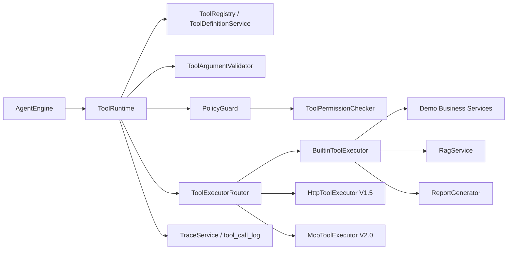
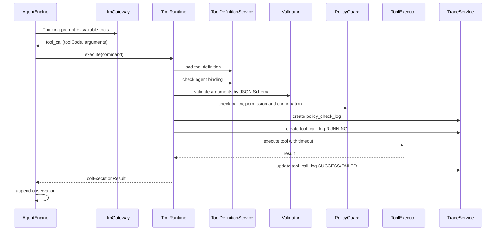

# AgentFlow Hub 工具系统设计

本文档用于沉淀 AgentFlow Hub 的工具系统设计，包括工具注册中心、工具运行时、JSON Schema 参数协议、权限控制、超时重试、内置工具、工具日志、Agent 调用流程和 V0.1/V1.0 实现边界。

核心结论：

> 工具系统采用“工具注册中心 + ToolRuntime + PolicyGuard + 内置工具适配器”的设计。模型只能提出工具调用意图，不能直接执行外部动作；真正的工具查找、绑定校验、参数校验、策略检查、权限判断、超时控制、重试和日志记录都由后端完成。

---

## 1. 设计目标

工具系统需要支撑：

- 平台内置工具注册。
- Agent 绑定指定工具。
- 将工具描述转换为模型可理解的 tool schema。
- 校验模型生成的工具参数。
- 控制工具调用权限。
- 在执行前进行策略检查。
- 控制工具超时和重试。
- 记录每次工具调用 trace。
- 将工具结果写回 Agent execution context。
- 支撑后续 HTTP 工具、MCP 工具扩展。

面试表达目标：

> 我没有让大模型直接执行任意操作，而是设计了一个受控的 ToolRuntime。模型只负责选择工具和生成参数，后端负责工具白名单、schema 校验、权限、超时、重试和日志，保证 Agent 执行可控、可观测、可扩展。

---

## 2. 工具系统边界

### 2.1 工具系统负责

- 工具定义管理。
- 工具 schema 管理。
- Agent 可用工具查询。
- 工具参数 JSON Schema 校验。
- 工具权限判断。
- 工具策略检查。
- 工具执行调度。
- 工具超时控制。
- 工具失败重试。
- 工具调用日志记录。
- 工具结果标准化。

### 2.2 工具系统不负责

- 判断 Agent 是否需要调用工具。
- 生成工具调用参数。
- 生成最终回答。
- 管理 Agent 状态机。
- 管理 RAG 检索。

这些分别由：

- `AgentEngine`
- `LlmGateway`
- `RagService`
- `TraceService`

承载。

---

## 3. 总体架构



核心组件：

| 组件 | 职责 |
| --- | --- |
| `ToolDefinitionService` | 管理工具定义，查询 Agent 可用工具 |
| `ToolRuntime` | 工具执行统一入口 |
| `ToolArgumentValidator` | 基于 JSON Schema 校验工具参数 |
| `PolicyGuard` | 工具执行前的策略检查，输出 `ALLOW` / `WARN` / `BLOCK` / `REVIEW` |
| `ToolPermissionChecker` | 校验用户、Agent、工具权限 |
| `ToolExecutorRouter` | 根据工具类型路由到具体 executor |
| `BuiltinToolExecutor` | 执行系统内置工具 |
| `HttpToolExecutor` | 执行 HTTP 工具，V1.5 可做 |
| `McpToolExecutor` | 执行 MCP 工具，V2.0 规划 |
| `TraceService` | 记录工具调用日志 |

---

## 4. 工具类型

工具类型使用：

```text
BUILTIN
HTTP
MCP
```

### 4.1 BUILTIN

V1.0 主体。

特点：

- 工具逻辑由后端代码实现。
- 工具定义存在数据库。
- 执行时根据 `tool_code` 路由到具体 Java handler。
- 安全、可控、适合个人项目落地。

### 4.2 HTTP

V1.5 可选增强。

特点：

- 工具配置 HTTP method、url、headers、body template。
- 需要更复杂的安全控制。
- 适合模拟调用外部业务系统。

### 4.3 MCP

V2.0 规划。

特点：

- 接入 MCP Server。
- 将 MCP tools 转换为平台工具定义。
- 不进入 V1.0 主线。

---

## 5. 数据模型回顾

核心表：

- `tool_definition`
- `agent_tool_binding`
- `tool_call_log`
- `policy_check_log`

### 5.1 tool_definition 关键字段

```text
id
tool_code
name
description
type
input_schema
output_schema
config
timeout_ms
retry_count
requires_confirmation
permission_level
status
```

### 5.2 agent_tool_binding 关键字段

```text
agent_id
tool_id
enabled
priority
config_override
```

### 5.3 tool_call_log 关键字段

```text
task_id
step_id
tool_id
tool_code
arguments
result
status
retry_count
latency_ms
error_code
error_message
```

---

## 6. 工具定义规范

### 6.1 tool_code 命名

使用小写蛇形：

```text
order_query
payment_log_query
ticket_query
knowledge_search
report_generate
```

规则：

- 全局唯一。
- 不使用中文。
- 不使用空格。
- 一旦发布，尽量不修改。

### 6.2 工具描述 description

description 是给模型看的，必须清楚说明：

- 工具能做什么。
- 什么时候应该使用。
- 需要哪些参数。
- 不能做什么。

示例：

```text
根据订单号查询订单状态、支付状态、支付错误码和订单金额。
当用户问题涉及具体订单、支付失败、订单状态时使用。
本工具只查询模拟订单数据，不会修改任何订单状态。
```

### 6.3 input_schema

使用 JSON Schema。

示例：

```json
{
  "type": "object",
  "properties": {
    "orderNo": {
      "type": "string",
      "description": "订单号，例如 order_1024"
    }
  },
  "required": ["orderNo"],
  "additionalProperties": false
}
```

### 6.4 output_schema

V1.0 不强制严格校验输出，但应保存结构说明。

示例：

```json
{
  "type": "object",
  "properties": {
    "orderNo": { "type": "string" },
    "paymentStatus": { "type": "string" },
    "errorCode": { "type": "string" }
  }
}
```

### 6.5 config

工具运行配置。

BUILTIN 示例：

```json
{
  "handler": "orderQueryTool",
  "readonly": true
}
```

HTTP 示例，V1.5：

```json
{
  "method": "GET",
  "url": "https://internal.example.com/orders/{orderNo}",
  "headers": {}
}
```

---

## 7. ToolSpec 给模型的结构

AgentEngine 在调用模型前，会通过 ToolRuntime 获取当前 Agent 可用工具。

建议内部结构：

```java
public class ToolSpec {
    private Long toolId;
    private String toolCode;
    private String name;
    private String description;
    private JsonNode inputSchema;
}
```

给模型的工具信息只包含：

- tool name/code。
- description。
- parameters schema。

不暴露：

- 内部 handler。
- 权限等级。
- 重试配置。
- HTTP URL。
- 敏感 headers。

---

## 8. 工具调用流程

### 8.1 总体流程



### 8.2 执行前校验

ToolRuntime 必须校验：

1. 工具是否存在。
2. 工具是否启用。
3. Agent 是否绑定该工具。
4. 当前用户是否拥有 Agent。
5. 工具参数是否符合 JSON Schema。
6. PolicyGuard 是否允许执行。
7. 工具是否需要人工确认。
8. 工具调用次数是否超出 Agent 预算。

### 8.3 执行后处理

ToolRuntime 必须：

- 标准化工具结果。
- 记录 `policy_check_log`。
- 记录 `tool_call_log`。
- 返回给 AgentEngine。
- 发布工具执行事件。

---

## 9. ToolExecutionCommand

建议结构：

```json
{
  "taskId": "30001",
  "stepId": "70003",
  "userId": "123",
  "agentId": "1001",
  "toolCode": "order_query",
  "arguments": {
    "orderNo": "order_1024"
  },
  "context": {
    "conversationId": "50001"
  }
}
```

Java 结构建议：

```java
public class ToolExecutionCommand {
    private Long taskId;
    private Long stepId;
    private Long userId;
    private Long agentId;
    private String toolCode;
    private JsonNode arguments;
    private Map<String, Object> context;
}
```

---

## 10. ToolExecutionResult

统一结果结构：

```json
{
  "success": true,
  "toolCode": "order_query",
  "summary": "订单 order_1024 当前支付状态为 PAY_FAILED，错误码 E_PAY_TIMEOUT。",
  "data": {
    "orderNo": "order_1024",
    "paymentStatus": "PAY_FAILED",
    "errorCode": "E_PAY_TIMEOUT"
  },
  "errorCode": null,
  "errorMessage": null,
  "latencyMs": 34
}
```

字段说明：

| 字段 | 说明 |
| --- | --- |
| `success` | 工具是否成功 |
| `toolCode` | 工具编码 |
| `summary` | 给模型阅读的简短摘要 |
| `data` | 给 trace 和前端展示的结构化结果 |
| `errorCode` | 失败错误码 |
| `errorMessage` | 失败说明 |
| `latencyMs` | 工具执行耗时 |

### 10.1 为什么需要 summary

原因：

- 模型不适合直接阅读很大的 JSON。
- summary 可以控制上下文长度。
- data 仍然保留完整结构供 Trace 页面展示。

---

## 11. 参数校验

### 11.1 校验方式

使用 JSON Schema 校验模型生成的 arguments。

校验内容：

- 必填字段。
- 字段类型。
- 枚举值。
- 字符串长度。
- 数值范围。
- 是否允许额外字段。

### 11.2 校验失败处理

如果校验失败：

1. 创建或更新 `tool_call_log`，状态 `REJECTED`。
2. 记录错误码 `TOOL_ARGUMENT_INVALID`。
3. 发布 `TOOL_FINISHED` 事件，状态 `REJECTED`。
4. 将错误 observation 写回 Agent 上下文。
5. 允许模型重新生成一次参数。
6. 连续失败超过阈值，任务失败。

### 11.3 示例 observation

```text
Tool order_query was rejected because required field orderNo is missing. Please call the tool again with valid arguments.
```

---

## 12. 权限设计

### 12.1 权限等级

工具权限等级：

```text
LOW
MEDIUM
HIGH
```

### 12.2 权限含义

| 等级 | 含义 | 示例 |
| --- | --- | --- |
| `LOW` | 只读、无敏感数据 | 知识库检索、报告生成 |
| `MEDIUM` | 查询业务数据，可能包含敏感信息 | 订单查询、日志查询、工单查询 |
| `HIGH` | 可能修改外部系统或执行危险操作 | SQL 写操作、发送通知、修改订单 |

### 12.3 V1.0 权限策略

V1.0 只做：

- Agent 必须绑定工具才能调用。
- 用户只能通过自己的 Agent 调用工具。
- 管理员才能创建和修改全局工具定义。
- `HIGH` 工具默认不允许普通 Agent 调用。

### 12.4 人工确认

字段：

```text
requires_confirmation
```

V1.0 预留，不强制完整实现。

适用场景：

- SQL 查询。
- 发送消息。
- 修改业务状态。
- 调用外部 HTTP 高权限接口。

### 12.5 PolicyGuard 策略检查

PolicyGuard 是 ToolRuntime 执行前的统一策略检查层。

决策类型：

```text
ALLOW
WARN
BLOCK
REVIEW
```

V1.0 轻量规则：

- Agent 未绑定工具：`BLOCK`。
- 工具未启用：`BLOCK`。
- JSON Schema 参数不通过：`BLOCK`。
- 工具权限等级为 `HIGH` 且未允许：`REVIEW` 或 `BLOCK`。
- 同一任务中重复调用相同工具和相同参数：第二次 `WARN`，第三次 `BLOCK`。
- 超出最大工具调用次数：`BLOCK`。

策略检查结果写入 `policy_check_log`，并通过 Trace 页面展示。

---

## 13. 超时与重试

### 13.1 超时

每个工具配置：

```text
timeout_ms
```

默认建议：

```text
order_query: 3000ms
payment_log_query: 5000ms
ticket_query: 5000ms
knowledge_search: 8000ms
report_generate: 10000ms
```

### 13.2 重试

每个工具配置：

```text
retry_count
```

默认建议：

```text
只读查询工具: 1 到 2 次
报告生成工具: 0 到 1 次
高权限工具: 默认不重试
```

### 13.3 重试原则

- 只对可重试异常重试。
- 参数错误不重试。
- 权限错误不重试。
- 业务未找到不重试。
- 超时可重试一次。
- 外部服务 5xx 可重试。

### 13.4 状态记录

工具调用状态：

```text
PENDING
RUNNING
SUCCESS
FAILED
TIMEOUT
REJECTED
```

---

## 14. 内置工具设计

V1.0 内置 5 个工具：

- `order_query`
- `payment_log_query`
- `ticket_query`
- `knowledge_search`
- `report_generate`

---

## 15. order_query

### 15.1 作用

根据订单号查询模拟订单状态、支付状态、金额和错误码。

### 15.2 使用时机

当用户问题涉及：

- 具体订单。
- 支付失败。
- 订单状态。
- 支付状态。
- 错误码。

### 15.3 input_schema

```json
{
  "type": "object",
  "properties": {
    "orderNo": {
      "type": "string",
      "description": "订单号，例如 order_1024"
    }
  },
  "required": ["orderNo"],
  "additionalProperties": false
}
```

### 15.4 result 示例

```json
{
  "success": true,
  "summary": "订单 order_1024 支付失败，错误码为 E_PAY_TIMEOUT，金额 199.00 CNY。",
  "data": {
    "orderNo": "order_1024",
    "amount": 199.00,
    "currency": "CNY",
    "status": "CREATED",
    "paymentStatus": "PAY_FAILED",
    "errorCode": "E_PAY_TIMEOUT"
  }
}
```

---

## 16. payment_log_query

### 16.1 作用

根据订单号或错误码查询模拟支付日志。

### 16.2 input_schema

```json
{
  "type": "object",
  "properties": {
    "orderNo": {
      "type": "string",
      "description": "订单号，例如 order_1024"
    },
    "errorCode": {
      "type": "string",
      "description": "支付错误码，例如 E_PAY_TIMEOUT"
    },
    "limit": {
      "type": "integer",
      "description": "最多返回日志条数",
      "minimum": 1,
      "maximum": 20,
      "default": 10
    }
  },
  "additionalProperties": false
}
```

### 16.3 额外校验

至少需要：

```text
orderNo 或 errorCode 二选一
```

JSON Schema draft 标准可以表达，但实现中也可以在 handler 内做业务校验。

### 16.4 result 示例

```json
{
  "success": true,
  "summary": "查询到 2 条支付错误日志，主要错误为支付网关响应超时。",
  "data": {
    "logs": [
      {
        "traceId": "pay-trace-1024",
        "level": "ERROR",
        "errorCode": "E_PAY_TIMEOUT",
        "message": "Payment gateway response timeout after 3000ms",
        "occurredAt": "2026-05-01T12:00:00+08:00"
      }
    ]
  }
}
```

---

## 17. ticket_query

### 17.1 作用

根据错误码或关键词查询历史相似工单。

### 17.2 input_schema

```json
{
  "type": "object",
  "properties": {
    "errorCode": {
      "type": "string",
      "description": "错误码，例如 E_PAY_TIMEOUT"
    },
    "keyword": {
      "type": "string",
      "description": "查询关键词，例如 支付超时"
    },
    "limit": {
      "type": "integer",
      "minimum": 1,
      "maximum": 10,
      "default": 5
    }
  },
  "additionalProperties": false
}
```

### 17.3 result 示例

```json
{
  "success": true,
  "summary": "找到 1 个历史相似工单，处理方式为检查支付渠道状态并引导用户重试。",
  "data": {
    "tickets": [
      {
        "ticketNo": "TCK-2026-001",
        "title": "支付网关超时导致订单支付失败",
        "solution": "确认用户未扣款后，引导用户重新支付；若已扣款则创建退款工单。"
      }
    ]
  }
}
```

---

## 18. knowledge_search

### 18.1 作用

让 Agent 主动进行二次知识库检索。

### 18.2 V1.0 定位

V1.0 可以注册该工具，但不强制在默认 Agent 流程中使用。

默认 Agent 流程已经有前置 RAG。

### 18.3 input_schema

```json
{
  "type": "object",
  "properties": {
    "query": {
      "type": "string",
      "description": "要检索的问题或关键词"
    },
    "topK": {
      "type": "integer",
      "minimum": 1,
      "maximum": 10,
      "default": 5
    }
  },
  "required": ["query"],
  "additionalProperties": false
}
```

### 18.4 result 示例

```json
{
  "success": true,
  "summary": "检索到 3 段与支付超时相关的知识库内容。",
  "data": {
    "hits": [
      {
        "chunkId": "10001",
        "fileName": "payment-error-guide.md",
        "score": 0.8421,
        "content": "E_PAY_TIMEOUT 表示支付网关响应超时..."
      }
    ]
  }
}
```

---

## 19. report_generate

### 19.1 作用

根据 Agent 已有分析、知识库引用和工具结果生成 Markdown 处理报告。

### 19.2 说明

该工具可以有两种实现：

1. 简单模板生成，不再调用 LLM。
2. 调用 LLM 生成更完整报告。

V1.0 推荐先用模板生成。

### 19.3 input_schema

```json
{
  "type": "object",
  "properties": {
    "title": {
      "type": "string",
      "description": "报告标题"
    },
    "summary": {
      "type": "string",
      "description": "问题摘要"
    },
    "rootCause": {
      "type": "string",
      "description": "原因分析"
    },
    "suggestions": {
      "type": "array",
      "items": { "type": "string" },
      "description": "处理建议"
    }
  },
  "required": ["title", "summary"],
  "additionalProperties": false
}
```

### 19.4 result 示例

```json
{
  "success": true,
  "summary": "已生成 Markdown 处理报告。",
  "data": {
    "markdown": "# order_1024 支付失败分析报告\n\n## 结论\n..."
  }
}
```

---

## 20. 工具结果进入 Agent 上下文

ToolExecutionResult 会被转换为 observation。

### 20.1 observation 格式

```json
{
  "type": "TOOL_RESULT",
  "toolCode": "order_query",
  "success": true,
  "summary": "订单 order_1024 支付失败，错误码为 E_PAY_TIMEOUT。",
  "dataRef": "tool_call_log:60001"
}
```

### 20.2 Prompt 中的展示格式

```text
[Tool Observation 1]
Tool: order_query
Status: SUCCESS
Summary:
订单 order_1024 支付失败，错误码为 E_PAY_TIMEOUT。
```

原则：

- Prompt 中优先放 summary。
- data 只在必要时放入。
- 完整 data 在 Trace 页面查看。
- 避免工具返回大 JSON 塞满上下文。

---

## 21. Agent 调用工具的约束

AgentEngine 给模型的规则中必须包含：

```text
- You may only call tools listed in Available Tools.
- You must provide arguments that match the tool schema.
- Do not invent tool results.
- If a tool call fails, decide whether to retry with corrected arguments or answer with available evidence.
- Do not call the same tool with the same arguments repeatedly.
```

后端仍需强制执行：

- 工具白名单。
- schema 校验。
- 最大工具调用次数。
- 重复工具调用检测。
- 超时和取消。

---

## 22. 重复调用检测

为避免 Agent 循环调用同一工具：

建议记录：

```text
toolCode + normalizedArgumentsHash
```

如果同一任务中连续重复调用：

- 第一次允许。
- 第二次可允许但提示 observation。
- 第三次拒绝，错误码 `TOOL_DUPLICATE_CALL`。

V0.1 可不做复杂检测。

V1.0 建议至少做简单检测。

---

## 23. 工具日志与 Trace

每次工具调用都必须记录 `tool_call_log`。

### 23.1 成功日志

记录：

- taskId。
- stepId。
- toolId。
- toolCode。
- arguments。
- result。
- status = `SUCCESS`。
- retryCount。
- latencyMs。

### 23.2 失败日志

记录：

- status = `FAILED` / `TIMEOUT` / `REJECTED`。
- errorCode。
- errorMessage。
- arguments。
- retryCount。
- latencyMs。

### 23.3 Trace 页面展示

Trace 页面应展示：

- 工具名称。
- 调用原因，可来自 AgentDecision reason。
- 入参。
- 出参。
- 状态。
- 耗时。
- 错误信息。

---

## 24. SSE 事件

工具调用相关事件：

```text
TOOL_STARTED
TOOL_FINISHED
```

### 24.1 TOOL_STARTED

```json
{
  "taskId": "30001",
  "sequenceNo": 8,
  "eventType": "TOOL_STARTED",
  "payload": {
    "toolCode": "order_query",
    "toolName": "订单查询工具",
    "argumentsPreview": {
      "orderNo": "order_1024"
    }
  }
}
```

### 24.2 TOOL_FINISHED

```json
{
  "taskId": "30001",
  "sequenceNo": 9,
  "eventType": "TOOL_FINISHED",
  "payload": {
    "toolCallId": "60001",
    "toolCode": "order_query",
    "status": "SUCCESS",
    "latencyMs": 34,
    "summary": "订单 order_1024 当前状态为 PAY_FAILED，错误码 E_PAY_TIMEOUT。"
  }
}
```

---

## 25. BuiltinToolExecutor 设计

### 25.1 接口

```java
public interface BuiltinToolHandler {
    String toolCode();

    ToolExecutionResult execute(ToolExecutionCommand command);
}
```

### 25.2 Router

```java
public class BuiltinToolExecutor {
    private final Map<String, BuiltinToolHandler> handlers;

    public ToolExecutionResult execute(ToolExecutionCommand command) {
        BuiltinToolHandler handler = handlers.get(command.getToolCode());
        if (handler == null) {
            throw new ToolException("TOOL_HANDLER_NOT_FOUND");
        }
        return handler.execute(command);
    }
}
```

### 25.3 Handler 示例

```text
OrderQueryToolHandler
PaymentLogQueryToolHandler
TicketQueryToolHandler
KnowledgeSearchToolHandler
ReportGenerateToolHandler
```

---

## 26. HTTP 工具预留

V1.5 可实现 HTTP 工具。

必须限制：

- 只允许管理员创建。
- URL 白名单。
- 禁止访问内网敏感地址。
- 限制 method。
- 限制 headers。
- 配置超时。
- 不允许模型直接控制完整 URL。

当前 V1.0 不实现，避免安全和复杂度失控。

---

## 27. 受控 MCP 工具预留

V2.0 可以接入 MCP，但只做受控适配。

思路：

- 管理员注册 allowlist MCP Server。
- 拉取 server tools 和 schema。
- 映射为 `tool_definition`。
- ToolRuntime 调用 McpToolExecutor。
- 仍然沿用 Agent 绑定、PolicyGuard、权限、日志、超时和 Trace。

V1.0 不做 MCP 的完整生态，只在文档和表设计中预留 `MCP` 类型。

---

## 28. V0.1 实现边界

V0.1 必须实现：

- `tool_definition` 初始化内置工具。
- Agent 可获取可用工具列表。
- ToolRuntime 执行内置工具。
- JSON Schema 基础校验。
- `order_query`。
- `payment_log_query`。
- `report_generate`。
- 工具调用日志。
- `TOOL_STARTED` / `TOOL_FINISHED` SSE 事件。

V0.1 可以简化：

- 不做完整工具 CRUD。
- 不做 HTTP 工具。
- 不做 MCP 工具。
- 不做人工确认。
- 不做复杂权限等级。
- 工具重试简单实现或暂不做。

---

## 29. V1.0 完成标准

V1.0 工具系统应支持：

1. 工具定义表驱动。
2. 管理员可以查看和启停工具。
3. Agent 可以绑定指定工具。
4. AgentEngine 可以获取当前 Agent 可用工具 specs。
5. 模型返回工具调用后，后端执行绑定校验。
6. 参数必须通过 JSON Schema 校验。
7. 工具有超时控制。
8. 工具有基础重试。
9. 每次工具调用都有 `tool_call_log`。
10. 每次工具执行前都有 PolicyGuard 轻量策略检查。
11. Trace 页面可以展示工具入参、出参、策略结果、耗时和失败原因。
12. 支持订单查询、支付日志查询、工单查询、知识库检索、报告生成 5 个内置工具。

---

## 30. V1.5 增强项

推荐增强：

- HTTP 工具。
- 工具调用人工确认。
- PolicyGuard 规则配置。
- 重复工具调用检测。
- 工具调用统计。
- 工具失败率统计。
- 工具级限流。
- 工具结果脱敏。
- 工具参数示例管理。
- 工具测试页面增强。

---

## 31. 面试表达重点

工具系统可以这样讲：

1. **工具调用受控**
   - 模型只能提出工具调用，后端负责查找、校验、策略检查、权限和执行。

2. **schema 驱动**
   - 工具参数用 JSON Schema 定义，模型生成的 arguments 必须校验通过。

3. **Agent 绑定**
   - 不是所有 Agent 都能调用所有工具，工具必须显式绑定到 Agent。

4. **可观测**
   - 每次工具调用都有 tool_call_log 和 policy_check_log，Trace 页面可以看到策略结果、入参、出参、状态、耗时和错误。

5. **稳定性**
   - 工具具备超时、重试、失败分类和最大调用次数限制。

6. **可扩展**
   - V1.0 先做 BUILTIN，后续可以扩展 HTTP 和受控 MCP，但仍复用同一套绑定、PolicyGuard、权限和日志体系。

---

## 32. 当前不做的内容

V1.0 暂不做：

- 用户在线编写任意代码工具。
- 工具插件市场。
- 完整 HTTP 工具安全沙箱。
- 完整 MCP Server 自动发现。
- 任意 MCP Server 自动接入。
- 工具调用审批流。
- 工具结果复杂脱敏规则。
- 写操作业务工具。
- 真实生产数据库 SQL 执行工具。

这些内容容易引入安全和复杂度问题，不进入当前核心闭环。
