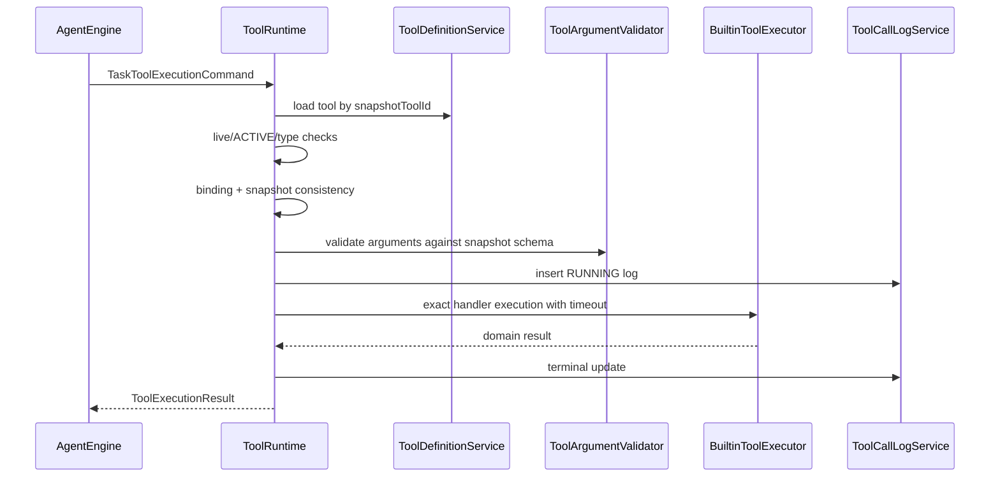

# AgentFlow Hub 工具系统设计

> 文档状态：**NORMATIVE**  
> 权威范围：ToolRuntime、工具定义、Agent 绑定、硬校验、参数协议、超时、重试和工具结果  
> 最近审查基线：`main@f276549`（V36）

---

## 1. 核心结论

工具系统采用：

```text
seeded tool_definition
+ explicit agent_tool_binding
+ immutable task tool snapshot
+ ToolRuntime hard validation
+ exact builtin handler allowlist
+ durable tool_call_log
```

模型只能提出 `CALL_TOOL(toolCode, arguments)`，不能直接获得 Java handler、HTTP client、数据库连接或 MCP client。

V0.1 只向支付诊断 Agent 暴露：

```text
order_query
payment_log_query
```

`report_generate` 虽然已有实现和定义，但不属于 V0.1 Agent 可用工具集合。最终报告由 Final Generation 或确定性页面导出完成。

PolicyGuard、人工确认、HTTP/MCP 工具和写操作全部后移。

---

## 2. 职责所有权

### 2.1 AgentEngine 负责

- 将 task snapshot 中的工具安全投影给模型；
- 解析模型返回的 toolCode；
- 最大工具调用次数；
- 重复调用检测；
- 调用 ToolRuntime；
- 将安全结果写入 observations；
- 决定继续 decision loop 或进入 Final Generation。

### 2.2 ToolRuntime 负责

- 按 snapshot toolId 加载当前工具；
- 检查工具未软删除且仍为 ACTIVE；
- 防御性复核 Agent binding；
- 对比 snapshot toolCode/schema hash/implementation version；
- 按 snapshot input schema 校验 arguments；
- 执行 per-tool timeout；
- 通过 exact builtin allowlist 路由 handler；
- 标准化工具结果；
- 写入 tool_call_log；
- 返回稳定失败，不泄漏内部异常。

### 2.3 ToolRuntime 不负责

- 判断是否需要调用工具；
- 生成参数；
- 维护 AgentTask 生命周期；
- 计算整个 task 的 maxToolCalls；
- 做重复循环检测；
- 拼装最终回答；
- 管理 RAG；
- 把普通合法性校验包装成 PolicyGuard。

### 2.4 Future Tool Policy 负责

只有真正动态、与风险治理相关的规则才进入后续 Tool Policy：

- 写操作是否需要审批；
- 敏感字段；
- 外部域名 allowlist；
- 用户/工具级限流；
- 数据脱敏；
- 业务时段和环境限制。

工具存在、ACTIVE、绑定、schema 和总调用预算属于硬执行契约，不属于可配置 Policy 决策。

---

## 3. 工具类型与版本边界

```text
BUILTIN
HTTP
MCP
```

### V0.1

只执行 `BUILTIN`。数据库即使存在其他类型定义，也不能进入 Agent snapshot。

### V1.x

可评估受控 HTTP adapter。必须由管理员配置完整 endpoint，模型只能提供 schema 参数，不能控制 scheme、host、port 或完整 URL。

### V2.0

可评估 allowlist MCP Adapter。MCP tool 仍映射到平台 ToolDefinition，并继续经过 binding、snapshot、ToolRuntime、timeout 和 Trace；模型不能直接操作 MCP client。

---

## 4. ToolDefinition

逻辑结构：

```java
record ToolDefinition(
    long id,
    String toolCode,
    String name,
    String description,
    ToolType type,
    JsonNode inputSchema,
    JsonNode outputSchema,
    JsonNode config,
    int timeoutMs,
    int retryCount,
    boolean requiresConfirmation,
    String permissionLevel,
    ToolStatus status,
    String implementationVersion
) {}
```

当前数据库尚无独立 `implementation_version` 列。V0.1 可从代码常量或 config 的受控字段解析，并写入 task snapshot。出现真正多版本并存需求后再增加显式列。

### 4.1 toolCode

- 小写蛇形；
- 全局唯一；
- 一旦被 task snapshot 或 Trace 使用，不原地重命名；
- 语义不兼容变化创建新 code 或提升 implementation version；
- 模型只看到 code，不看到 handler bean 名。

### 4.2 description

描述必须说明：

- 工具做什么；
- 什么时候使用；
- 关键限制；
- 是否只读；
- 不得包含内部表名、连接串、URL、密钥或实现类。

### 4.3 inputSchema

V0.1 使用受控 JSON Schema 子集：

- object；
- properties；
- required；
- additionalProperties=false；
- string/integer/number/boolean/array；
- enum；
- min/max；
- minLength/maxLength；
- items；
- 简单 `anyOf`，仅在当前 validator 明确支持时使用。

工具上线前必须通过 schema contract test。数据库中是 JSON object 不代表它就是当前 validator 支持的合法 schema。

### 4.4 outputSchema

V0.1 保存 output schema 作为文档和测试契约，但 ToolRuntime 主要依赖统一结果 wrapper。handler 返回 data 时仍应通过单元测试验证结构；不在 V0.1 建设完整通用 output-schema runtime validator。

### 4.5 config

BUILTIN config 只保存安全、受控标识，例如：

```json
{
  "handler": "orderQueryTool",
  "readonly": true,
  "implementationVersion": "builtin-v1"
}
```

实际路由必须是代码中的 exact allowlist：

```text
orderQueryTool      -> OrderQueryToolHandler
paymentLogQueryTool -> PaymentLogQueryToolHandler
```

禁止根据数据库任意字符串动态获取任意 Spring Bean、反射加载类或执行脚本。

---

## 5. Agent Tool Binding

V0.1 使用 `agent_tool_binding`：

```text
userId
agentId
toolId
enabled
priority
```

规则：

- Agent owner 由复合外键证明；
- 绑定不复制 tool schema；
- 只有 binding enabled、tool live/ACTIVE、type=BUILTIN 才能进入新 task snapshot；
- 首个支付 Agent 只绑定 `order_query` 和 `payment_log_query`；
- `report_generate` 不绑定；
- V0.1 不支持 per-Agent config override。

Task 创建后，binding 变化只影响新 task。运行中 task 使用其 snapshot；当前工具被禁用或软删除时，ToolRuntime 将其视为紧急撤销并拒绝执行。

---

## 6. 给模型的安全 ToolSpec

```java
record AgentToolSpec(
    long toolId,
    String toolCode,
    String name,
    String description,
    JsonNode inputSchema
) {}
```

模型可见字段只有：

```text
toolCode
name
description
inputSchema
```

不可见：

- handler；
- config；
- outputSchema；
- timeout/retry；
- permission level；
- confirmation flag；
- HTTP URL/headers；
-数据库细节；
- 内部工具 ID 是否连续。

Task snapshot 额外保存 `inputSchemaHash`、`implementationVersion` 和 `timeoutMs`，但这些不进入模型 Prompt。

### 6.1 Schema hash

```text
inputSchemaHash = SHA-256(canonical JSON bytes of inputSchema)
```

Canonical JSON 必须固定：

- UTF-8；
- object keys 排序；
- 无无意义空白；
- 数字格式稳定。

Task 运行时若当前定义的 hash 与 snapshot 不同，ToolRuntime 返回 `TOOL_DEFINITION_CHANGED`，不使用新 schema 静默校验旧 decision。

---

## 7. ToolExecutionCommand

AgentTask 路径：

```java
record TaskToolExecutionCommand(
    long taskId,
    long stepId,
    long userId,
    long agentId,
    long snapshotToolId,
    String snapshotToolCode,
    String snapshotInputSchemaHash,
    String snapshotImplementationVersion,
    JsonNode arguments,
    Instant deadlineAt
) {}
```

约束：

- task/step/user/agent 由内部调用方提供，不接受 HTTP body 自报；
- arguments 必须是 JSON object；
- tool 通过 ID 精确加载，不按模型字符串直接路由；
- toolCode 只用于 snapshot 一致性和日志；
- ToolRuntime 不接受任意 handler 名；
- per-call timeout 不超过 task 剩余 deadline。

现有 standalone tool test 可以继续使用单独命令，taskId/stepId 为空；它不等同于 AgentTask 执行，也不能被当作 Agent 闭环证据。

---

## 8. 执行顺序



精确校验顺序：

1. command 基础合法性；
2. 当前 tool 存在、未删除；
3. status=ACTIVE；
4. type=BUILTIN；
5. Agent binding 仍存在且 enabled；
6. current toolCode 与 snapshot 一致；
7. current schema hash 与 snapshot 一致；
8. current implementation version 与 snapshot 兼容；
9. arguments 按 snapshot schema 校验；
10. 创建 RUNNING log；
11. 执行 handler；
12. 写 terminal log；
13. 返回标准结果。

在步骤 1–9 被拒绝的调用仍应有 `REJECTED` log。若为了获得 log ID 需要先插入 PENDING，再更新 REJECTED，应保证生命周期约束一致。

---

## 9. ToolExecutionResult

```java
record ToolExecutionResult(
    ToolExecutionStatus status,
    String toolCode,
    String summary,
    JsonNode data,
    String errorCode,
    String errorMessage,
    long latencyMs,
    long toolCallLogId
) {}
```

状态：

```text
SUCCESS
REJECTED
FAILED
TIMEOUT
```

不再同时维护一个可能与 status 冲突的可写 `success` 字段。若 API/旧代码需要 `success`，它只能派生为 `status == SUCCESS`。

字段规则：

| 状态 | summary/data | error |
| --- | --- | --- |
| `SUCCESS` | summary 非空，data 为受限 JSON object | error 为空 |
| `REJECTED` | safe summary 可选，data 为空或安全 object | error 非空 |
| `FAILED` | safe summary 可选，data 不含内部异常 | error 非空 |
| `TIMEOUT` | 固定安全 summary，data 为空 | error=`TOOL_TIMEOUT` |

Engine 只把以下内容放入后续 Prompt：

```text
toolCode
status
safe summary
bounded safe data（确有必要时）
```

完整内部异常、stack、SQL、URL、配置和敏感字段不进入 observation。

---

## 10. 参数校验

### 10.1 校验失败

参数不合法：

- 不进入 handler；
- tool log=`REJECTED`；
- errorCode=`TOOL_ARGUMENT_INVALID`；
- 返回稳定字段级摘要，不返回 Java exception；
- 本次 `CALL_TOOL` 已消耗 Engine 的 tool call 预算；
- Engine 可将 rejection observation 提供给下一次 decision，但不会让 ToolRuntime 自行再次调用模型。

### 10.2 业务校验

JSON Schema 不能表达或当前 validator 未支持的跨字段规则，由 handler 在执行任何业务查询前校验。例如 `payment_log_query` 要求 `orderNo` 或 `errorCode` 至少一个非空。

业务参数错误仍为 `REJECTED`，不是系统 `FAILED`。

---

## 11. 超时与重试

### 11.1 V0.1 timeout

```text
order_query: 3000 ms
payment_log_query: 5000 ms
```

实际 timeout：

```text
min(snapshot timeout, current emergency timeout cap, remaining task deadline)
```

V0.1 handler 都是本地只读查询。实现可以使用 Future/受控 executor 或数据库 statement timeout，但不得宣称仅在返回后检查时钟就是“硬超时”。

### 11.2 V0.1 retry

V0.1 默认：

```text
retryCount = 0
```

原因：

- 两个工具是快速本地只读查询；
- 自动重试会模糊一次 Agent 动作对应多少实际调用；
- 当前 tool_call_log 一行还没有 attempt 子表。

### 11.3 后续 retry 模型

支持外部工具前必须增加：

```text
sideEffectClass:
  READ_ONLY
  IDEMPOTENT_WRITE
  NON_IDEMPOTENT_WRITE

idempotencyKeyStrategy
retryableErrorClasses
maxAttempts
backoff
```

并新增 `tool_call_attempt`。timeout/连接中断可能表示远端结果未知，未来需要 `OUTCOME_UNKNOWN`，不得对非幂等写操作盲目重试。

---

## 12. V0.1 内置工具

### 12.1 order_query

用途：按订单号查询模拟订单。

Input：

```json
{
  "type": "object",
  "properties": {
    "orderNo": {
      "type": "string",
      "minLength": 1,
      "maxLength": 64
    }
  },
  "required": ["orderNo"],
  "additionalProperties": false
}
```

返回 data：

```text
orderNo
amount
currency
status
paymentStatus
errorCode nullable
```

### 12.2 payment_log_query

用途：按订单号或错误码查询有限条模拟支付日志。

Input：

```json
{
  "type": "object",
  "properties": {
    "orderNo": {"type": "string", "minLength": 1, "maxLength": 64},
    "errorCode": {"type": "string", "minLength": 1, "maxLength": 64},
    "limit": {"type": "integer", "minimum": 1, "maximum": 20}
  },
  "additionalProperties": false
}
```

业务规则：`orderNo` 或 `errorCode` 至少一个存在。默认 limit=10 由 handler 设置，不能把 JSON Schema `default` 误解为 validator 会自动填值。

返回日志必须限制条数和单条 message 长度，避免将任意大日志塞入 Prompt。

### 12.3 report_generate

当前已有定义和 handler，但 V0.1：

- 不绑定到支付 Agent；
- 不进入 availableTools；
- 不作为完成标准；
- 不再扩展。

若只是将最终答案包装成 Markdown，使用确定性 renderer。只有未来需要保存/发送报告这一真实外部动作时，再重新评估是否作为工具。

---

## 13. 重复调用与循环控制

重复调用检测属于 AgentEngine：

```text
toolCode + SHA-256(canonical JSON arguments)
```

ToolRuntime 可以返回已存在 log/result 的内部引用，但不自行决定 Agent 是否应该继续。

V0.1：

- 首次执行；
- 第二次相同调用不执行 handler，Engine复用已有 observation；
- 第三次相同意图使任务失败为 `AGENT_DUPLICATE_TOOL_LOOP`。

不将此规则放进 PolicyGuard。

---

## 14. 日志与事件

### 14.1 tool_call_log

每次 AgentTask 工具调用必须记录：

```text
taskId
stepId
toolId
toolCode/name snapshot
arguments snapshot
result snapshot
status
latency
safe error
startedAt/finishedAt
```

task/step 归属必须通过复合一致性约束或等价数据库不变量证明。

### 14.2 Event

ToolRuntime 或其 application adapter 产生：

```text
TOOL_STARTED
TOOL_FINISHED
```

规则：

- `TOOL_STARTED` 在 RUNNING log 提交后；
- `TOOL_FINISHED` 在 terminal log 提交后；
- payload 只包含 toolCallId、toolCode、status、latency 和 safe summary；
- 默认不把完整 arguments/result 推送到浏览器；
- Engine/Runner 通过统一 TaskEventAppender 写事件，不让 ToolRuntime 自己分配 sequence。

---

## 15. 安全要求

- exact builtin allowlist；
- 禁止任意反射/脚本/Bean 名执行；
- 模型不可控制 URL、SQL 或 class name；
- arguments/result 大小限制；
- 日志字段脱敏；
- 只把安全 summary/data 写回模型；
- 当前工具禁用作为紧急 kill switch；
- owner/Agent binding 防御性复核；
- 高权限字段在 V0.1 不形成虚假的“已实现审批”；
- Tool test endpoint 仅用于开发/管理，不开放为普通 Agent 绕过入口。

---

## 16. 失败分类

```text
TOOL_NOT_FOUND
TOOL_DISABLED
TOOL_NOT_BOUND
TOOL_TYPE_UNSUPPORTED
TOOL_DEFINITION_CHANGED
TOOL_HANDLER_NOT_FOUND
TOOL_ARGUMENT_INVALID
TOOL_RESULT_INVALID
TOOL_EXECUTION_FAILED
TOOL_TIMEOUT
TOOL_LOG_PERSIST_FAILED
```

工具执行成功但 terminal log 持久化失败时，不得向 Engine 返回普通 SUCCESS。对 V0.1 只读查询，可以返回系统失败并允许用户重建 task；未来副作用工具必须有独立 outcome reconciliation。

---

## 17. V0.1 验收

必须证明：

1. 未绑定工具不进入 task snapshot；
2. 非 BUILTIN/禁用/软删除工具不进入 snapshot；
3. 模型无法通过 toolCode 选择未授权 toolId；
4. snapshot schema 与当前 schema 不一致时拒绝；
5. 参数错误不进入 handler；
6. handler 只能从 exact allowlist 路由；
7. timeout 不超过 task 剩余 deadline；
8. 每个 Agent tool call 关联正确 task/step；
9. 工具内部异常不进入 Prompt、API 或 event；
10. 支付 Agent 只能成功调用 order_query 和 payment_log_query；
11. report_generate 不出现在 V0.1 availableTools；
12. Engine 的重复调用防护能终止循环。
